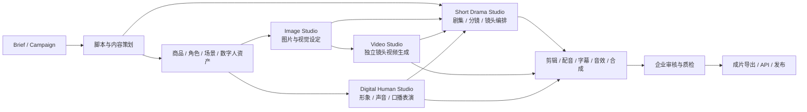
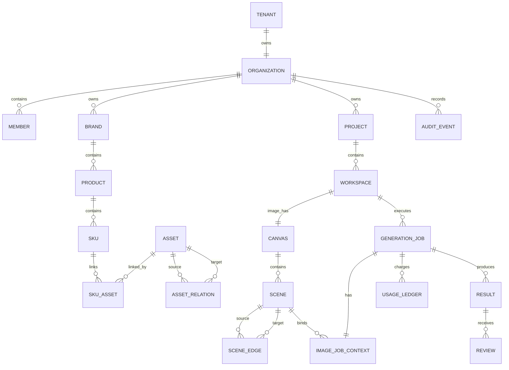
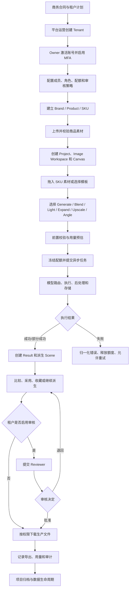
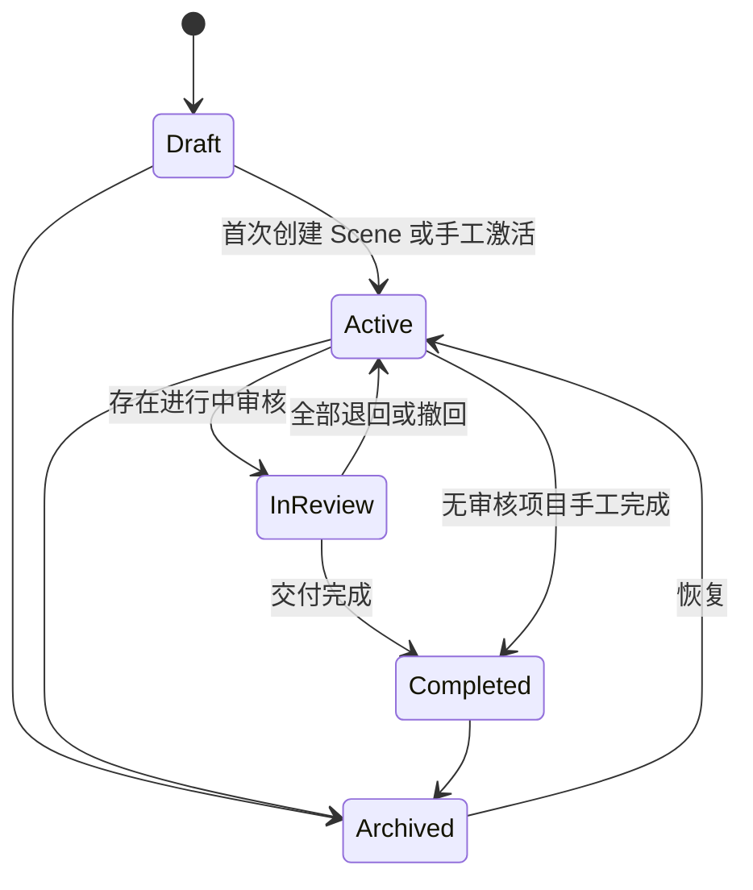
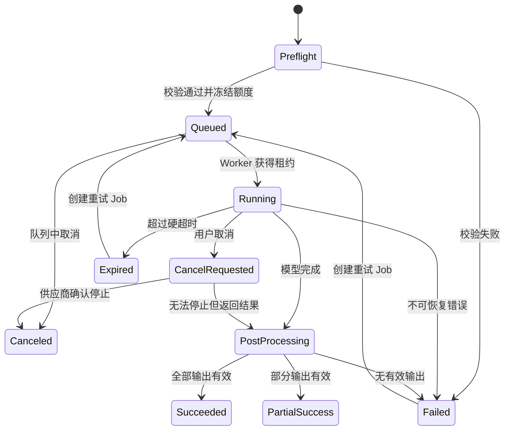
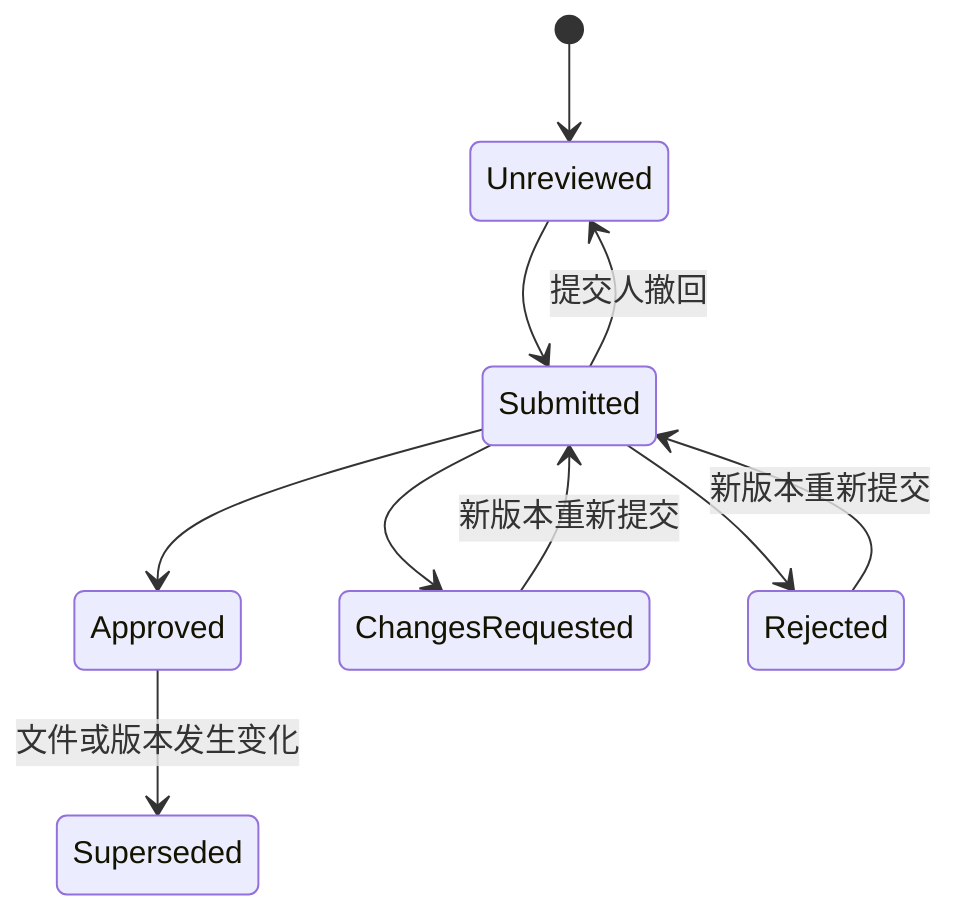
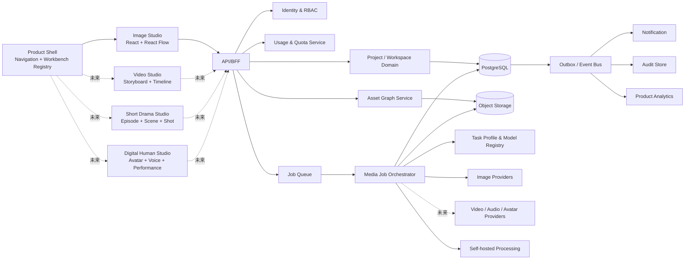

# 企业级 AI 全链路内容生产工作台 PRD（MVP：图片工作台）

| 项目 | 内容 |
| --- | --- |
| 文档版本 | V1.2 |
| 文档状态 | 产品评审稿 |
| 编写日期 | 2026-07-15 |
| 产品形态 | 独立 ToB AI 内容生产 SaaS；MVP 只交付图片工作台，长期扩展视频、短剧和数字人工作台 |
| 首个目标客户 | Content Studio |
| 默认部署 | 日本区域多租户 SaaS，架构支持后续单租户独立部署 |
| 默认语言 | 日文；管理端同时提供英文 |
| MVP 参考范围 | TheSEA / Beachside 第 15-21 页演示及相关操作录屏 |
| MVP 画布技术基线 | React Flow（MIT）只作为图片工作台的无限画布交互层 |

---

## 1. 文档目的

本文定义一套独立的企业级 AI 全链路内容生产平台，并详细规定其第一个可交付模块：图片工作台 MVP。MVP 链路覆盖企业开通、成员与权限、品牌/SKU 素材入库、无限画布创作、异步 AI 图片生成、结果派生、审核、导出、用量结算、审计和数据生命周期。

平台终局不是单一静态图工具，而是共享企业资产、模型能力、任务编排、审核和计量底座的多工作台产品，后续可以独立提供视频生成、一键短剧视频生产和数字人生成，并允许图片、视频、音频、脚本、角色、数字人和成片在同一项目中持续流转。

本文同时作为以下工作的共同基线：

- 产品、设计、研发、AI、测试、运维的需求对齐依据。
- Content Studio 商务范围、交付边界和验收口径的输入。
- 技术 Spike、架构设计、迭代计划和成本评估的输入。
- 后续 UI 原型、接口设计、数据模型和测试用例的上位文档。

本文不假设复用 Reela 的任何系统能力。若未来复用通用基础设施，只能通过独立、可替换的接口发生，不改变本产品的数据归属和部署边界。

---

## 2. 产品概述

### 2.1 产品定义

本产品是一套面向企业内容团队的全链路 AI 生产工作台。平台以统一的企业资产、项目、任务、模型、审核、用量和审计系统为底座，按业务场景提供彼此独立但可串联的 Image Studio、Video Studio、Short Drama Studio 和 Digital Human Studio。

当前 MVP 只交付 Image Studio。Content Studio 用户以品牌和 SKU 素材为核心，在无限画布中创建多个 Scene，并通过结构化任务完成商品场景生成、商品融图、打光、扩图、超分和视角生成。MVP 不包含任何视频、短剧或数字人生成界面与能力。

产品不要求普通设计师理解底层模型、参数或 Prompt 工程。用户表达“要做什么”，系统完成模型选择、提示词编排、参考图组织、任务调度、成本记录和失败降级。

### 2.2 产品定位

本产品不是：

- 单一的文生图输入框。
- 面向普通消费者的图片娱乐工具。
- Photoshop、Figma 或完整像素编辑器的替代品。
- Reela 的附属模块或共享业务数据库。
- 对 TheSEA 视觉资产、品牌文案和界面的像素级复制。

本产品是：

- 面向 ToB 企业的 AI 全链路内容生产系统。
- 以 Organization、Brand、Product、SKU、Character 和 Asset 为长期业务基础的统一资产平台。
- 由多个专业工作台组成：图片使用 Canvas/Scene，视频使用 Shot/Storyboard/Timeline，短剧使用 Script/Episode/Character/Shot，数字人使用 Avatar/Voice/Performance。
- 以异步任务、资产谱系、版本、审核、导出、用量和审计为共用闭环。
- 可通过不同模型供应商持续升级的模型无关、媒介可扩展平台。

### 2.3 核心价值

1. **降低使用门槛**：用工具和模板代替复杂 Prompt。
2. **提高商品视觉产量**：一次任务生成 1-4 个候选，结果可继续派生。
3. **保护品牌资产**：企业隔离、权限控制、审计和明确的数据生命周期。
4. **保持创作可追溯**：每个结果都能追溯输入、参数、模型版本、操作者和父 Scene。
5. **控制模型成本**：提交前估算、任务级计量、失败释放、企业用量报表。
6. **降低模型绑定**：用户操作与具体模型解耦，后台可按任务路由和降级。
7. **跨模态复用**：图片结果可继续成为视频首帧、短剧角色/场景参考或数字人背景，无需重复上传和失去来源关系。
8. **统一企业治理**：不同工作台共用账号、权限、资产、审核、用量、审计和数据政策，避免形成多个孤立工具。

### 2.4 长期产品愿景

平台按“共用底座 + 专业工作台”发展，而不是把所有能力强行塞进一个无限画布。

“一键短剧”定义为由系统自动编排脚本解析、角色和场景绑定、分镜、镜头生成、声音、字幕、合成和质检，并允许人在关键节点介入；它不是一次不可解释、不可恢复的单模型调用。

所有未来工作台必须共享同一个 Asset Graph，使任意内容都能追溯其输入、任务、模型、操作者、成本、审核和下游使用位置。

### 2.5 首个市场楔子与差异化

首个市场楔子不是“另一个通用 AI 生图网站”，而是：**面向日本美妆、个护及消费品牌的企业级商品内容生产工作台，在不牺牲商品身份和企业数据治理的前提下，让一次批准的品牌/SKU 资产持续复用于图片、视频、短剧和数字人内容。**

V1 必须优先建立以下差异化，而不是以功能数量与 TheSEA 或通用模型平台竞争：

1. **商品身份保真**：围绕包装结构、Logo、日文标签、数量、主色、透明/反光材质建立基准集、质量标记和人工审核。
2. **Brand/Product/SKU 治理**：企业素材不是临时上传附件，而是有版本、用途、权限、留存和下游引用关系的生产资产。
3. **结构化无 Prompt 工作流**：设计师通过业务动作、模板和可视化控件工作，模型、提示词和参考图编排由平台管理。
4. **日本企业交付能力**：默认日本区域、日文界面、MFA、租户隔离、审计、供应商数据政策和可删除证明从 V1 建设。
5. **跨模态连续性**：当前只交付图片，但批准图片及其 SKU、来源、审核和成本记录可被后续工作台直接引用，不需重复上传或丢失来源。

在启动 Video Studio 的正式建设前，Image Studio 至少应证明：Content Studio 连续 4 周有真实生产使用、第 5.3 节质量门槛达标、第 5.4 节单位经济门槛可成立，并且相较现有流程显著缩短获得一张批准图片的时间。该门槛用于验证平台楔子，不代表后续工作台已包含在当前合同中。

---

## 3. 背景与问题

Content Studio 设计团队已经在试用 TheSEA，对其无限画布、Scene 派生和结构化图片任务形成了使用习惯。当前首要诉求是交付一套企业级图片工作台；平台战略则是逐步扩展为覆盖图片、独立视频、短剧和数字人的全链路内容生产系统。

现有通用生图产品通常存在以下问题：

- 以 Prompt 为中心，设计师需要反复试词，学习成本高。
- 上传素材、生成结果和项目之间缺乏企业级结构。
- 结果只按时间排列，无法表达哪张图由哪张图派生。
- 同一商品在融图、打光和视角变化中容易发生外形、标签和材质漂移。
- 长任务缺少可靠的排队、重试、恢复和成本归因。
- 缺少团队权限、审核、审计、留存和企业数据边界。

本项目需要同时解决“设计师是否好用”和“企业是否敢用”两个问题。

---

## 4. 目标与非目标

### 4.1 V1 业务目标

| 编号 | 目标 |
| --- | --- |
| G-01 | Content Studio 设计师不输入 Prompt 也能基于 SKU 素材完成第一张可用商品场景图。 |
| G-02 | 用户能在一个无限画布内完成生成、融图、打光、扩图、超分和快速视角派生。 |
| G-03 | 所有 AI 任务具备排队、进度、取消、失败解释、重试和结果追溯。 |
| G-04 | 所有素材、项目、任务、结果和用量均严格归属企业租户。 |
| G-05 | 企业管理员可以管理成员、角色、配额、功能开关、审核策略和数据留存。 |
| G-06 | 用户可将批准或选中的结果按标准规格下载并交付下游电商/营销流程。 |
| G-07 | 平台能度量每类任务的成功率、可用率、平均耗时和单位可用图成本。 |

### 4.2 V1 产品目标

- Content Studio 真实 SKU 集上完成端到端生产闭环。
- 无限画布支持至少 100 个 Scene、400 张缩略图的稳定浏览和操作。
- 普通创作者不直接选择底层模型，系统按任务类型自动路由。
- 持有有效编辑租约的写操作自动保存；异常关闭后可恢复到最近一次服务器状态或本地恢复副本。
- 生成历史不可被普通成员无痕篡改，关键操作进入审计日志。

### 4.3 V1 非目标

- 不提供完整图层、钢笔、复杂蒙版、色彩曲线等专业像素编辑能力。
- 不提供 PSD、AI、Figma 原生文件导入导出。
- 不承诺基于单张商品图实现严格 3D 几何正确的新视角。
- 不在 V1 提供多人同时编辑同一 Canvas 的实时光标协作。
- 不在 V1 提供公开 API、外部工作流编排和客户自带模型密钥。
- 不在图片 MVP 提供视频、音频、短剧编排或数字人生成；这些是明确的后续独立工作台，不属于本期遗漏或永久排除项。
- 不在 V1 提供本地化私有部署；但数据模型和服务边界必须为其预留。

---

## 5. 成功指标

### 5.1 图片 MVP 北极星指标

**每周被企业确认可用于生产的静态图数量。**

“可用于生产”定义为：结果被标记为已采用，或在启用审核时被 Reviewer 批准，并完成一次无水印原图导出。

平台长期北极星指标为：**每周由企业通过本平台完成并确认可投入业务使用的跨模态内容交付数量**。交付可以是图片、独立视频、短剧成片或数字人视频，但当前 MVP 只统计图片。

### 5.2 V1 上线后 8 周目标

| 指标 | 目标 | 说明 |
| --- | ---: | --- |
| 新用户首次产出时间 | 中位数不超过 15 分钟 | 从首次进入产品到首次成功生成 |
| 创建任务成功率 | 不低于 98% | 通过前置校验并进入队列 |
| 平台任务完成率 | 不低于 95% | 排除用户主动取消和内容安全拦截 |
| 首次生成可用率 | 不低于 60% | 一次任务至少一张被标记采用 |
| 平均迭代次数 | 不高于 3 次 | 从源图到采用结果的任务数 |
| 核心操作无 Prompt 占比 | 不低于 70% | 使用模板/结构化控件完成 |
| 审核周转时间 | 中位数不超过 1 个工作日 | 启用审核的租户 |
| 任务成本可归因率 | 100% | 每个任务关联租户、项目、用户和操作类型 |
| 严重跨租户数据事故 | 0 | 上线阻断指标 |

### 5.3 AI 质量发布门槛

质量评测使用 Content Studio 提供并冻结版本的至少 20 个 SKU 基准集。每个功能对每个 SKU 执行 3 个固定场景，共 60 个任务；基础生成、Blend、Directional Light、Expand 和 Quick Angle 每个任务固定生成 4 个输出，Upscale 固定生成 1 个输出。发布评测期间不得通过改变输出数量、人工挑选随机种子或删除失败任务改变分母。

每个输出由 2 名 Content Studio 业务代表在不知道模型/路由版本的情况下独立评审；出现分歧时由指定业务负责人裁决。评测必须同时报告以下指标：

- **任务通过率**：任务至少产生 1 个可用输出的占比。
- **输出可用率**：全部预期输出中被判定可用于后续生产的占比；供应商失败、损坏文件和基础检查不通过均计入不可用分母。
- **全输出 P0 严重缺陷率**：全部实际输出中出现 P0 严重商品变形的占比，不能只统计被采用结果。
- **批准结果 P0 严重缺陷率**：进入批准状态的输出中出现 P0 严重缺陷的占比，用于验证审核防线。
- **单张可用图成本**：本轮全部实际可变成本除以可用输出数量，必须同时满足第 5.4 节成本上限。

| 功能 | 任务通过率 | 输出可用率 | 全输出 P0 严重缺陷率 | 批准结果 P0 严重缺陷率 |
| --- | ---: | ---: | ---: | ---: |
| 基础生成/商品场景 | >= 75% | >= 35% | <= 10% | 0% |
| Blend 商品融图 | >= 75% | >= 35% | <= 10% | 0% |
| Directional Light | >= 70% | >= 30% | <= 12% | 0% |
| Expand | >= 80% | >= 45% | <= 8% | 0% |
| Upscale | >= 90% | >= 90% | <= 2% | 0% |
| Quick Angle | >= 60% | >= 25% | <= 15% | 0% |

P0 严重商品变形包括：主体品类错误、包装数量错误、瓶体/盒体主结构明显改变、Logo 被替换、关键标签文字生成不相关内容、主要配色错误、透明/反光材质完全失真。每次评测保存基准集版本、Task Profile、模型路由、原始输出和评审记录，并报告样本量及 95% 置信区间；重试结果单独报告，不覆盖首次执行结果。

### 5.4 商业成功与单位经济门槛

Phase 0 必须根据 Content Studio 合同计价和真实供应商报价，将下列比例换算为每个 Task Profile 的日元绝对上限；未形成经产品、财务和交付负责人批准的成本上限，不得进入 Content Studio Pilot。

| 指标 | V1 门槛 | 口径 |
| --- | ---: | --- |
| 贡献毛利率 | >= 60% | 归因收入扣除模型、存储、网络、导出等可变成本后的比例，不含一次性研发投入 |
| 模型供应商成本占归因收入 | <= 35% | 按已结算任务和合同价格归因 |
| 失败/无可用输出成本占比 | <= 10% | 失败、过期及无可用输出任务产生的供应商成本 / 全部供应商成本 |
| 单张批准图片成本 | 不高于 Task Profile 上限 | 全部实际可变成本 / 批准并完成生产导出的图片数 |
| 单张可用图片时间 | 相较 Content Studio 当前基线缩短 >= 50% | 从开始任务到首张采用/批准结果，不含客户等待审核的非工作时间 |

每个 Task Profile 必须同时配置 `cost_cap_per_task` 和 `cost_cap_per_usable_output`。任一操作的 7 日滚动成本超过上限 20%，或预估成本在提交前已超过单任务上限时，系统必须阻止高风险路由继续放量，通知 Platform Operator，并由产品、AI 和财务共同决定调价、换路由或暂停功能。

---

## 6. 范围与优先级

### 6.1 版本定义

| 优先级 | 含义 |
| --- | --- |
| V1 必须 | Content Studio 首次可生产版本的合同与验收范围。 |
| V1.1 增强 | V1 稳定后 8-12 周内扩展，不阻塞首次上线。 |
| V2 企业化 | 面向更多企业客户、规模化销售或私有部署的能力。 |

### 6.2 功能范围

| 模块 | V1 必须 | V1.1 增强 | V2 企业化 |
| --- | --- | --- | --- |
| 企业开通 | 租户、邀请、密码登录、MFA、基础 RBAC | SAML/OIDC SSO | SCIM、IP Allowlist、私有部署 |
| 素材库 | Brand/Product/SKU/Asset、批量上传、标签、版本 | CSV 批量建 SKU、重复检测 | PIM/DAM 对接、自动元数据 |
| 无限画布 | 平移、缩放、框选、拖拽、Scene、连线、自动保存 | 分组、对齐线、画布模板 | 实时多人协作、大型画布分区 |
| 生成任务 | 基础生成、Blend、Directional Light、Expand、Upscale、Quick Angle | Point Light、Precise Angle、Extract、Remove、Retouch | 批量 Replicate、品牌规则引擎 |
| 结果处理 | 1-4 结果、对比、采用、收藏、继续派生、下载 | 批注、版本对比、批量处理 | 外部审批、API/Webhook |
| 审核 | 可选审核开关、提交、批准、退回 | 多级审核、评论线程 | 企业流程编排 |
| 用量 | 预估、冻结、结算、企业用量台账 | 预算预警、部门成本中心 | 合同账单、发票系统对接 |
| 管理 | 成员、角色、配额、功能开关、审计 | 模型策略、模板管理 | 多区域、客户自管密钥 |

上述表格只描述图片工作台及企业底座的交付范围。“V2 企业化”不等同于视频、短剧或数字人模块；新媒介工作台应分别建立独立 PRD、质量基准和排期。

### 6.3 全链路产品路线

以下阶段表达产品演进顺序，不构成当前 MVP 的合同交付承诺。

| 阶段 | 工作台 | 核心能力 | 与前序模块的连接 |
| --- | --- | --- | --- |
| A：当前 MVP | Image Studio | 商品图生成、Blend、Light、Expand、Upscale、Angle、审核与导出 | 形成品牌、SKU、角色/场景参考和首帧资产 |
| B：独立视频 | Video Studio | 文生视频、图生视频、首尾帧、参考视频、镜头运动、时长/比例、补帧、超分、音画预览 | 直接使用 Image Studio 结果作为首帧、尾帧、角色或场景参考 |
| C：一键短剧 | Short Drama Studio | 剧本导入/生成、分集、角色卡、场景卡、分镜、镜头任务、连续性、配音、字幕、合成、质检和成片导出 | 编排图片、视频、声音和数字人资产，保留 Episode/Shot 级谱系 |
| D：数字人 | Digital Human Studio | 数字人形象、声音、口播脚本、情绪/动作、唇形、背景、商品植入和批量生成 | 数字人可作为独立营销视频，也可进入短剧角色和镜头 |
| E：自动化与开放平台 | Content Automation | 跨工作台 Workflow、批量生产、品牌规则、API、Webhook、模板市场和发布连接器 | 将完整链路配置为可复用企业生产流程 |

#### 6.3.1 Video Studio 目标边界

- 支持创建以 Video Workspace 为首个专业工作区的新 Project，不要求经过图片工作台。
- 支持文本、图片、首尾帧、参考视频、角色和商品资产作为输入。
- 以 Shot 为最小生成和重试单位，保存模型、参数、时长、帧率、成本和来源。
- 提供 Storyboard 和轻量 Timeline，而不是复用图片 Scene 卡片完成所有视频操作。
- 视频结果可进入审核、下载、短剧镜头或数字人合成。

#### 6.3.2 Short Drama Studio 目标边界

- 支持剧本导入、结构解析、Episode/Scene/Shot 拆解和人工修订。
- 建立角色、服装、场景、道具、声音和视觉风格的一致性资产。
- 一键创建生产计划并自动触发所需图片、视频、声音和字幕任务。
- 任一镜头失败可局部重试，不要求整部短剧重做。
- 提供镜头审核、连续性检查、对白/字幕对齐、时间线合成和成片质检。
- “一键”强调自动编排与自动推进，同时保留关键节点的人工确认和回退能力。

#### 6.3.3 Digital Human Studio 目标边界

- 支持上传/生成数字人形象，绑定有授权的 Voice Profile。
- 支持文本、音频或结构化脚本驱动口播，配置语言、情绪、动作和镜头。
- 支持商品、图片或视频背景，以及批量替换脚本和产品生成多版本内容。
- 支持独立数字人视频导出，也支持作为 Short Drama 的角色或素材输入。
- 必须具备肖像权、声音授权、合成标识、内容安全和滥用防控链路。

### 6.4 MVP 必须预留但不实现的扩展边界

图片 MVP 不建设空白的视频页面或未完成的数字人入口，但底层设计必须满足：

1. Project 是 campaign/交付容器，一个 Project 可以包含多个有类型的 Workspace；MVP 每个 Project 只创建一个 `IMAGE` Workspace，未来可在同一 Project 中增加 `VIDEO`、`SHORT_DRAMA`、`DIGITAL_HUMAN` Workspace。
2. Asset 是通用媒体资产，具备 `media_type` 和跨资产关系；MVP 只允许创建和处理图片资产。
3. Job、Task Profile、Usage Ledger、Review 和 Audit 不得在表名或核心协议中写死 Image。
4. Result 能引用通用 Asset，并允许未来生成视频、音频、字幕、脚本和工程文件。
5. 平台导航由 Workbench Registry 驱动；未启用模块不显示，不使用“敬请期待”占位页面。
6. 不为未来功能提前实现复杂业务表，但通用 ID、事件、权限和资产谱系不能阻碍后续增加新媒介。

### 6.5 V1 Scope Manifest

本表是 V1 合同范围、研发排期和上线判定的规范性清单。`M0` 为技术 Spike，`M1` 为内部 Alpha，`M2` 为 Content Studio Pilot，`M3` 为 Production；`M1/M3` 表示 M1 完成功能主链路、M3 完成生产门槛，其他双里程碑同理。表内需求全部包含在 V1 合同范围；V1.1/V2 需求不包含，除非通过第 28 节变更单加入。每一行在进入对应里程碑前必须拆成可测试的交付任务并指定到人。

| V1 需求范围 | 里程碑 | 主责 | 前置依赖 | 验收证据 | 合同范围 |
| --- | --- | --- | --- | --- | :---: |
| FR-AUTH-001-006、FR-ORG-001-006 | M1/M3 | BE + Security | 身份服务、邮件、Tenant 上下文 | 21.1、21.7、权限 E2E | 是 |
| FR-ASSET-001-011 | M1/M2 | FE + BE | 对象存储、扫描、Catalog 模型 | 21.2、上传/版本集成测试 | 是 |
| FR-PROJ-001-007、010-011 | M1/M2 | FE + BE | Tenant、成员、Workspace 模型 | 21.1、21.3、项目生命周期 E2E | 是 |
| FR-CANVAS-001-014、017-020 | M0/M2 | FE + BE | React Flow PoC、编辑租约、增量保存 | 21.3、性能及并发 E2E | 是 |
| FR-SCENE-001-012、FR-LINEAGE-001-006 | M1/M2 | FE + BE | Canvas、Asset Graph、Job | 21.3、21.4、谱系集成测试 | 是 |
| FR-GEN-001-010、FR-PFREE-001-007 | M0/M2 | Product + AI + FE | Task Profile、模板、成本预估 | 21.4、5.3 基准、UAT | 是 |
| FR-BLEND-001-007、FR-LIGHT-001-007 | M0/M2 | AI + FE | 参考图编排、质量检查 | 21.4、5.3 基准 | 是 |
| FR-EXPAND-001-007、FR-UP-001-007、FR-ANGLE-001-007 | M0/M2 | AI + FE | 编辑控件、模型能力、风险提示 | 21.4、5.3 基准 | 是 |
| FR-RESULT-001-009 | M1/M2 | FE + BE | Result、Asset、质量反馈 | 21.4、结果操作 E2E | 是 |
| FR-REVIEW-001-009、FR-EXPORT-001-008 | M2/M3 | FE + BE | 权限、文件哈希、签名下载 | 21.5、审核/导出 E2E | 是 |
| FR-JOB-001-014、FR-ERR-001-006 | M1/M2 | BE + AI | 队列、Worker、供应商适配器 | 21.4、故障注入、幂等测试 | 是 |
| FR-USAGE-001-010、013-016 | M1/M3 | BE + Finance | Job 快照、定价、不可变台账 | 21.6、5.4、每日对账 | 是 |
| FR-AUDIT-001-007、FR-NOTIFY-001-005 | M1/M3 | BE + Security | Outbox、邮件、审计存储 | 21.1、21.7、审计抽样 | 是 |
| FR-ADMIN-001-007、FR-OPS-001-007 | M2/M3 | FE + BE + SRE | RBAC、用量、Task Profile、支持工单 | 21.6、21.7、运营演练 | 是 |
| FR-SEARCH-001-004、FR-I18N-001-005 | M2 | FE + BE | 权限过滤、日文资源、索引 | UAT、越权搜索、日文视觉回归 | 是 |
| FR-MODEL-001-006 | M0/M2 | AI + SRE | 供应商合同、Secret Manager | 5.3、21.4、模型灰度记录 | 是 |
| DR-001-009 | M1/M3 | BE + QA | 领域模型、事务、租约 | 数据一致性/并发/删除集成测试 | 是 |
| NFR-PERF-001-006、NFR-REL-001-006 | M0/M3 | FE + BE + SRE | 容量环境、监控、备份 | 21.3、恢复演练、性能报告 | 是 |
| NFR-SEC-001-010 | M1/M3 | Security + BE | 云安全基线、DPA、供应商政策 | 21.7、渗透测试、安全评审 | 是 |
| NFR-A11Y-001-005、NFR-OBS-001-005 | M2/M3 | FE + SRE + QA | 设计系统、trace/metrics/logs | A11Y 检查、可观测性演练 | 是 |

若本表、功能需求和验收标准出现冲突，以更具体的需求编号及其已批准变更单为准。Phase 2 Pilot 可以限制用户数和流量，但不能据此删除被列入 M3 的 V1 安全、数据一致性、计量或运营要求；它们必须在 Production 前完成。

---

## 7. 用户与角色

### 7.1 用户画像

#### 7.1.1 企业创作者 Creator

- 主要人员：品牌设计师、电商设计师、视觉内容制作人员。
- 核心任务：找到 SKU，快速生成候选图，继续派生并下载。
- 核心诉求：少填参数、结果可控、失败可恢复、不破坏原图。

#### 7.1.2 审核者 Reviewer

- 主要人员：设计负责人、品牌负责人、项目负责人。
- 核心任务：检查品牌一致性、商品准确性和交付规格。
- 核心诉求：快速比较、知道输入和操作、退回理由明确。

#### 7.1.3 企业管理员 Org Admin

- 主要人员：Content Studio 项目管理员、信息系统或创意运营人员。
- 核心任务：成员、权限、配额、模板、数据留存、用量和审计。
- 核心诉求：可管理、可追踪、可控制成本、避免数据越权。

#### 7.1.4 企业所有者 Tenant Owner

- 主要人员：商务合同负责人或企业系统责任人。
- 核心任务：接受服务条款、指定管理员、查看整体用量和安全配置。

#### 7.1.5 平台运营 Platform Operator

- 主要人员：本产品内部运营、客户成功、SRE 和受控支持人员。
- 核心任务：创建租户、配置计划、处理故障、查看脱敏运行状态。
- 核心诉求：在最小权限和完整审计下支持客户。

### 7.2 权限矩阵

| 能力 | Owner | Admin | Creator | Reviewer | Viewer | Platform Operator |
| --- | :---: | :---: | :---: | :---: | :---: | :---: |
| 企业设置与合同计划 | 是 | 查看 | 否 | 否 | 否 | 按授权配置 |
| 成员与角色 | 是 | 是 | 否 | 否 | 否 | 仅故障授权 |
| 查看全部项目 | 是 | 是 | 仅获授权 | 仅获授权 | 仅获授权 | 默认否 |
| 创建/编辑项目 | 是 | 是 | 是 | 否 | 否 | 否 |
| 上传/编辑素材 | 是 | 是 | 是 | 查看 | 查看 | 否 |
| 创建生成任务 | 是 | 是 | 是 | 否 | 否 | 否 |
| 取消本人任务 | 是 | 是 | 是 | 否 | 否 | 故障处理 |
| 取消任意任务 | 是 | 是 | 否 | 否 | 否 | 故障处理 |
| 提交审核 | 是 | 是 | 是 | 否 | 否 | 否 |
| 批准/退回 | 是 | 可配置 | 否 | 是 | 否 | 否 |
| 下载预览 | 是 | 是 | 是 | 是 | 是 | 否 |
| 下载生产原图 | 是 | 是 | 按审核策略 | 是 | 按授权 | 否 |
| 查看用量与成本 | 是 | 是 | 仅本人/项目 | 按授权 | 否 | 聚合/受控 |
| 查看审计日志 | 是 | 是 | 否 | 否 | 否 | 受控 |
| 删除企业数据 | 是 | 按授权 | 否 | 否 | 否 | 仅执行审批单 |

权限判断必须同时满足租户、项目和角色三个层级。任何服务端接口不得只依赖前端隐藏按钮实现权限控制。

---

## 8. 核心概念与领域对象

| 对象 | 定义 |
| --- | --- |
| Tenant | 独立企业客户的数据、安全、用量和合同边界。 |
| Organization | Tenant 内的组织主体。V1 一个 Tenant 对应一个 Organization。 |
| Brand | 品牌资产归属，例如某化妆品品牌。 |
| Product | 商品系列或产品，例如某款香水。 |
| SKU | 可独立生产和销售的具体规格。 |
| Workbench | 一类专业生产模块及其能力定义。MVP 只启用 Image，未来包括 Video、Short Drama 和 Digital Human。 |
| Workspace | Project 内某一专业工作台的业务实例，具有不可变类型；例如 Image Workspace、Video Workspace。 |
| Asset | 上传或生成的通用媒体资产及元数据；MVP 只处理图片。 |
| Asset Relation | 资产之间的来源、引用、合成、首尾帧、角色或背景关系。 |
| Project | 一次 campaign、商品视觉任务或交付项目，是成员、审核策略和跨工作台内容的容器。 |
| Canvas | Image Workspace 下的无限画布。图片 MVP 每个 Image Workspace 固定一个 Canvas。 |
| Scene | 画布中的创作节点，包含输入、操作、状态和 1-4 个结果。 |
| Scene Edge | Scene 之间的派生关系，记录操作类型和来源结果。 |
| Generation Job | 一次不可变的 AI 任务执行记录。 |
| Result | Generation Job 产出的候选内容，引用一个通用 Asset；MVP 中为单张图片。 |
| Review | 对 Result 的提交、批准、退回和说明。 |
| Usage Ledger | 配额冻结、结算、释放和人工调整记录。 |
| Audit Event | 对安全、权限、数据和生产有意义的不可变操作记录。 |
| Task Profile | 某种用户意图对应的模型路由、参数范围、成本和降级策略。 |

### 8.1 核心关系

未来领域对象包括 Script、Episode、Character、Location、Storyboard、Shot、Timeline、Voice Profile、Avatar、Performance 和 Render。它们不属于图片 MVP 的实现范围，但必须通过所属 Workspace 引用统一 Tenant、Project、Asset、Job、Review、Usage 和 Audit 对象。

---

## 9. 信息架构

### 9.1 图片 MVP 一级导航

1. **首页 Dashboard**：最近项目、待审核、任务状态、用量概览。
2. **项目 Projects**：项目列表、筛选、创建、归档。
3. **素材 Assets**：Brand/Product/SKU/Asset 管理。
4. **审核 Reviews**：待审核、已批准、已退回。
5. **用量 Usage**：任务、额度、成本和趋势。
6. **企业管理 Admin**：成员、角色、功能、配额、安全、审计。

Creator 默认进入首页；Reviewer 默认看到待审核；Admin 默认看到企业运行概况。

### 9.2 工作台布局

| 区域 | 内容 |
| --- | --- |
| 顶部栏 | 返回项目、项目名、工作区名、保存/编辑租约状态、撤销/重做、协作者/权限、导出入口。 |
| 左侧工具栏 | Select、Generate、Blend、Light、Expand、Upscale、Angle、Asset。 |
| 左侧素材面板 | Playground 最近素材、上传、Brand/Product/SKU 浏览和搜索。 |
| 中央视口 | 无限画布、Scene、派生连线、框选区域。 |
| 右侧属性面板 | 当前工具参数、Scene 信息、结果详情、审核信息。 |
| 底部控制 | 缩放百分比、适配画布、定位选中项、小地图开关。 |
| 全局任务中心 | 运行中、成功、失败任务；跨页面持续存在。 |

### 9.3 响应式策略

- V1 生产编辑仅正式支持桌面浏览器，最小有效宽度 1280px。
- 1024-1279px 提供受限模式，侧栏可折叠，但仍允许查看和轻量编辑。
- 移动端仅提供任务状态、审核和预览，不提供完整画布编辑。

### 9.4 长期平台导航与工作台切换

长期一级导航扩展为：Dashboard、Assets、Image Studio、Video Studio、Short Drama Studio、Digital Human Studio、Reviews、Usage、Admin。

- MVP 只显示已启用的 Image Studio，不展示不可用模块。
- 用户先创建作为 campaign/交付容器的 Project，再在项目内创建一个或多个有类型的 Workspace；MVP 自动创建一个 Image Workspace。
- “发送到 Video Studio”等操作默认在同一 Project 内创建或使用对应 Workspace；只有成员、审核或交付边界确实不同，才由用户显式创建新 Project。
- “发送到 Video Studio”“加入短剧”“作为数字人背景”等跨工作台动作通过 Asset Graph 创建引用，不复制无来源文件。
- Dashboard 和全局任务中心聚合全部工作台；各工作台保留最适合其任务的专业界面。
- 图片使用无限画布；视频使用镜头板和时间线；短剧使用剧集/场景/镜头生产看板；数字人使用形象、声音、脚本和表演配置界面。
- 不要求用户在不同产品间重复登录、上传素材、配置权限、查看额度或执行审核。

---

## 10. 完整端到端链路

### 10.1 企业开通链路

1. Platform Operator 根据已生效合同创建 Tenant。
2. 配置企业名称、区域、套餐、月度额度、并发上限、存储上限、功能开关和默认留存策略。
3. 系统向 Tenant Owner 发送一次性激活链接，链接 24 小时有效且只能使用一次。
4. Owner 设置密码、启用 MFA、接受服务条款和数据处理说明。
5. Owner 邀请 Admin、Creator、Reviewer、Viewer。
6. 被邀请人必须使用受邀邮箱激活；邀请 7 天失效，可由 Admin 撤销或重发。
7. 所有成员变更、角色变更和首次登录进入审计日志。

### 10.2 素材准备链路

1. Admin 或 Creator 创建 Brand、Product 和 SKU。
2. 用户上传商品正面、侧面、背面、包装、Logo、材质参考和场景参考。
3. 系统执行格式、大小、损坏、透明通道和基础清晰度检查。
4. 用户为素材设置用途、视角、是否为主图、版本和可见范围。
5. SKU 至少有一张“主商品图”后才能进入 Prompt-free 生成。
6. 被替换的素材保留版本记录；已用于历史任务的版本不得物理覆盖。

### 10.3 创作链路

1. 用户创建 Project，设置可选默认 Brand/SKU、成员和审核策略。
2. 系统在 Project 下创建 Image Workspace 和 Canvas，并恢复该用户上次视口。
3. 用户从素材库拖入图片，形成 Source Scene；或点击 Generate 创建空白 Draft Scene。
4. 用户选择工具、输入最少必要参数，系统显示预计用量和输出数量。
5. 提交派生操作时，系统在同一事务中创建父 Scene 附近的目标 Generation Scene、派生边、Job 和 Reserve 台账；目标 Scene 立即进入排队状态，用户可以继续操作其他 Scene。
6. 任务完成后 Worker 只更新目标 Scene 的任务状态并写入 Result，不新增或移动画布结构；派生连线和操作标签在提交成功时已显示。
7. 用户选择某个 Result 作为下一步输入，继续 Blend、Light、Expand、Upscale 或 Angle。
8. 用户将结果标记为“采用”，或提交审核。

### 10.4 审核与交付链路

1. 启用审核时，Creator 选择一个或多个结果并提交。
2. Reviewer 在审核中心查看原始 SKU、父结果、操作参数和大图。
3. Reviewer 可批准、退回修改或拒绝；退回/拒绝必须填写原因。
4. 批准后结果锁定审核版本；后续修改会生成新版本并重新审核。
5. 用户按规定格式下载单图或 ZIP，并可附带 CSV/JSON manifest。
6. 系统记录下载人、时间、结果版本、文件规格和来源项目。

### 10.5 结算与审计链路

1. 提交任务前计算预计用量并检查余额及并发限制。
2. 任务接受时冻结预计额度，防止并发超额。
3. 成功后按实际输出和实际模型调用结算。
4. 完全失败且供应商未产生可计费结果时释放全部冻结额度。
5. 部分成功按成功输出结算，释放剩余额度。
6. 用户取消时：未分发任务全额释放；已分发任务按实际供应商成本和合同规则结算。
7. 所有冻结、扣减、释放和人工调整均写入不可变台账。

---

## 11. 功能需求

### 11.1 账号、登录与会话

| 编号 | 优先级 | 需求 |
| --- | --- | --- |
| FR-AUTH-001 | V1 | 仅受邀企业成员可以注册；不开放公共自助注册。 |
| FR-AUTH-002 | V1 | 支持邮箱+密码登录，密码不少于 12 位，并执行泄露密码和常见密码检查。 |
| FR-AUTH-003 | V1 | Owner、Admin 和 Platform Operator 强制启用 MFA；其他角色可由企业策略强制。可采用托管身份服务降低实现成本，但不得在 Pilot 或 Production 省略。 |
| FR-AUTH-004 | V1 | 连续 5 次失败后触发渐进式限制，并通知账号持有人。 |
| FR-AUTH-005 | V1 | 闲置 30 分钟会话锁定，最长会话 12 小时；重新认证后返回原页面。 |
| FR-AUTH-006 | V1 | 用户可查看并撤销自己的活跃会话。 |
| FR-AUTH-007 | V1.1 | 支持企业 SAML 2.0 或 OIDC SSO，并可禁用密码登录。 |
| FR-AUTH-008 | V2 | 支持 SCIM 用户和组同步。 |

### 11.2 企业、成员与权限

| 编号 | 优先级 | 需求 |
| --- | --- | --- |
| FR-ORG-001 | V1 | Platform Operator 可创建、暂停、恢复和终止 Tenant；每次操作必须关联工单原因。 |
| FR-ORG-002 | V1 | Admin 可邀请、禁用、重新启用成员并分配预定义角色。 |
| FR-ORG-003 | V1 | 项目可设置为企业可见或指定成员可见，默认仅创建者和 Admin 可见。 |
| FR-ORG-004 | V1 | 成员被禁用后立即失去新请求权限，活跃会话在 60 秒内失效。 |
| FR-ORG-005 | V1 | 删除成员不删除其历史操作、项目或任务，历史记录显示姓名快照和已停用状态。 |
| FR-ORG-006 | V1 | 所有服务端查询必须强制带 Tenant 上下文，跨租户 ID 不得返回资源存在性。 |
| FR-ORG-007 | V1.1 | 支持自定义角色，由 Admin 按权限点组合。 |
| FR-ORG-008 | V2 | 支持部门、成本中心和跨组织项目。 |

### 11.3 Brand、Product、SKU 与素材库

| 编号 | 优先级 | 需求 |
| --- | --- | --- |
| FR-ASSET-001 | V1 | 支持 Brand > Product > SKU 三级结构，名称在同级可重复但编码必须唯一。 |
| FR-ASSET-002 | V1 | SKU 必填字段：名称、SKU Code、所属 Product、状态；可选字段：品类、颜色、容量、市场、标签。 |
| FR-ASSET-003 | V1 | 支持 JPEG、PNG、WebP，单文件最大 50MB，最长边不超过 8192px。 |
| FR-ASSET-004 | V1 | PNG 透明通道必须保留；系统生成缩略图不得覆盖原文件。 |
| FR-ASSET-005 | V1 | 支持拖拽、多选上传和断点重试；失败文件不影响同批其他文件。 |
| FR-ASSET-006 | V1 | 素材用途包括：主商品图、正面、侧面、背面、包装、Logo、材质、场景、人物和其他。 |
| FR-ASSET-007 | V1 | 一个 SKU 必须且只能有一个当前主商品图；更换主图不影响历史任务。 |
| FR-ASSET-008 | V1 | 上传后执行 MIME、文件头、解码、尺寸、清晰度和恶意文件检查。 |
| FR-ASSET-009 | V1 | 支持按 Brand、Product、SKU、用途、上传人、日期和关键词筛选。 |
| FR-ASSET-010 | V1 | 素材删除先进入回收站 30 天；被 Legal Hold 或保留策略锁定的素材不可删除。 |
| FR-ASSET-011 | V1 | 任何被任务引用的素材必须保留不可变版本，前端替换只创建新版本。 |
| FR-ASSET-012 | V1.1 | 支持 CSV 批量创建/更新 SKU，并提供逐行校验报告。 |
| FR-ASSET-013 | V1.1 | 提供感知哈希重复检测，提示重复但不自动删除。 |
| FR-ASSET-014 | V2 | 对接企业 PIM、DAM 或对象存储。 |

### 11.4 项目、Workspace 与 Canvas

| 编号 | 优先级 | 需求 |
| --- | --- | --- |
| FR-PROJ-001 | V1 | 创建项目时填写名称、可选默认 Brand/SKU、负责人、成员和审核策略；Project 本身不绑定单一工作台类型。 |
| FR-PROJ-002 | V1 | 项目状态为 Draft、Active、In Review、Completed、Archived。 |
| FR-PROJ-003 | V1 | 归档项目只读，Admin 或 Owner 可恢复；归档不立即删除数据。 |
| FR-PROJ-004 | V1 | 每个 V1 项目自动创建一个 `IMAGE` Workspace，并在其中创建一个 Canvas；Workspace 和 Canvas 名称默认为项目名。 |
| FR-PROJ-005 | V1 | 项目列表显示最近编辑、负责人、Workspace 类型、Scene 数、运行任务数、待审核数和聚合用量。 |
| FR-PROJ-006 | V1 | 支持按状态、Brand、负责人、更新时间和成员筛选。 |
| FR-PROJ-007 | V1 | 项目删除进入 30 天回收站，期间可恢复；永久删除仅 Owner/Admin 可执行。 |
| FR-PROJ-008 | V1.1 | 项目可基于模板创建预置 Scene、尺寸和任务配置。 |
| FR-PROJ-010 | V1 | Project 是 campaign/交付容器；成员权限、默认审核策略和聚合用量在 Project 层管理，专业内容归属于 Workspace。 |
| FR-PROJ-011 | V1 | Workspace 类型创建后不可修改；产生首个业务对象后不可删除类型实例，只能归档。 |
| FR-PROJ-009 | V2 | 一个 Image Workspace 支持多个 Canvas 和跨 Canvas 引用。 |

### 11.5 无限画布

| 编号 | 优先级 | 需求 |
| --- | --- | --- |
| FR-CANVAS-001 | V1 | 支持鼠标/触控板平移、滚轮缩放、适配全部、适配选中和回到 100%。 |
| FR-CANVAS-002 | V1 | 缩放范围为 10%-400%，缩放以指针位置为中心。 |
| FR-CANVAS-003 | V1 | 支持单选、Shift 多选、框选、拖拽移动和 Delete 删除。 |
| FR-CANVAS-004 | V1 | 拖动 Scene 时保持稳定尺寸，不因加载状态或按钮出现导致布局跳动。 |
| FR-CANVAS-005 | V1 | Scene 之间以有向连线表示派生关系，连线显示操作类型。 |
| FR-CANVAS-006 | V1 | 用户不能手工创建不对应真实派生关系的业务连线。 |
| FR-CANVAS-007 | V1 | 支持复制/粘贴 Scene 结构和输入引用；复制不会重新调用模型或重复计费。 |
| FR-CANVAS-008 | V1 | 支持撤销/重做画布移动、删除、复制、参数草稿等本地编辑；已提交任务不因撤销而消失。 |
| FR-CANVAS-009 | V1 | 持有有效编辑租约时，每次结构修改在 1 秒无操作后自动保存；顶部显示 Saving、Saved、Offline、Lease Lost、Read-only。 |
| FR-CANVAS-010 | V1 | 网络中断时在本地保留未同步编辑；恢复后仅在原租约仍有效且服务器 `structure_revision` 未被其他编辑者推进时重放，否则保留服务器版本并生成可恢复副本。 |
| FR-CANVAS-011 | V1 | 打开项目时恢复该用户最后一次视口；“适配全部”不修改保存的 Scene 位置。 |
| FR-CANVAS-012 | V1 | 支持从素材库拖入一个或多个素材，分别创建 Source Scene。 |
| FR-CANVAS-013 | V1 | 画布空白区域右键提供粘贴、创建 Scene、适配全部；Scene 右键提供复制、删除、重命名、查看来源。 |
| FR-CANVAS-014 | V1 | 100 个 Scene、400 张缩略图时仍可完成平移、缩放和选中，不得冻结主线程超过 200ms。 |
| FR-CANVAS-015 | V1.1 | 支持分组、锁定、对齐辅助线和注释。 |
| FR-CANVAS-016 | V2 | 支持实时多人协作、远端光标和冲突解决。 |
| FR-CANVAS-017 | V1 | 用户进入编辑模式时必须取得 Canvas 单编辑者租约；同一 Canvas 同时最多一名编辑者，其他成员以只读模式进入并看到当前编辑者。 |
| FR-CANVAS-018 | V1 | 客户端每 20 秒发送租约心跳，服务端租约 60 秒无心跳失效；租约令牌仅保存哈希，所有用户发起的画布结构写请求同时校验租约和 `structure_revision`。 |
| FR-CANVAS-019 | V1 | 编辑者可主动释放/移交租约；其他 Creator 可请求接管，Admin/Owner 可强制接管。强制接管前显示风险确认，所有操作写入审计。 |
| FR-CANVAS-020 | V1 | 租约丢失后客户端立即禁止继续写入，保留未同步本地恢复副本，并允许用户在取得新租约后人工选择复制到新 Scene，不得盲目覆盖服务器状态。 |

### 11.6 Scene 通用行为

每个 Scene 固定包含：标题、输入预览、操作类型、任务状态、输出区域、结果操作和来源信息。Scene 可以是 Source、Draft、Generation、Review Summary 四类。

| 编号 | 优先级 | 需求 |
| --- | --- | --- |
| FR-SCENE-001 | V1 | Source Scene 仅引用原始 Asset，不改变原文件。 |
| FR-SCENE-002 | V1 | Draft Scene 在提交前可修改参数，不产生费用。 |
| FR-SCENE-003 | V1 | 提交任务后冻结输入和参数快照，任何修改必须创建新任务。 |
| FR-SCENE-004 | V1 | 一个任务支持 1-4 个输出；部分结果成功时 Scene 显示 Partial Success。 |
| FR-SCENE-005 | V1 | Scene 标题默认由“操作类型 + 序号”生成，用户可重命名。 |
| FR-SCENE-006 | V1 | Scene 展示创建者、创建时间、最近更新时间和任务耗时。 |
| FR-SCENE-007 | V1 | 删除 Scene 默认仅从画布隐藏并进入回收站，不删除底层任务和审计。 |
| FR-SCENE-008 | V1 | 删除父 Scene 时，系统提示其子 Scene 数量；默认保留子 Scene 并标记来源已隐藏。 |
| FR-SCENE-009 | V1 | 选择 Result 后可设为 Scene 主结果；主结果用于缩略图和后续默认输入。 |
| FR-SCENE-010 | V1 | 用户可查看任务详情，包括输入、参数、Task Profile、模型显示名、耗时、用量和错误。 |
| FR-SCENE-011 | V1 | 普通用户看到业务化模型显示名，不默认暴露供应商密钥、内部 Prompt 或路由规则。 |
| FR-SCENE-012 | V1 | 派生任务提交时必须在同一事务创建目标 Scene、Scene Edge、Job 和 Reserve；Worker 只按 Job 状态机回填 Scene 内容和 Result，不取得编辑租约、不新增或移动画布结构。 |

### 11.7 生成通用设置

| 编号 | 优先级 | 需求 |
| --- | --- | --- |
| FR-GEN-001 | V1 | 所有任务统一支持输出数量 1-4、目标比例、质量档位和可选补充描述。 |
| FR-GEN-002 | V1 | V1 比例至少包含 1:1、4:5、3:4、4:3、16:9、9:16。 |
| FR-GEN-003 | V1 | 质量档位为 Draft、Standard、High，后台映射到 Task Profile，不要求用户选择模型。 |
| FR-GEN-004 | V1 | 参数变化时实时更新预计额度范围和预计时间范围。 |
| FR-GEN-005 | V1 | 提交前检查输入数、格式、权限、额度、并发、内容安全和任务能力。 |
| FR-GEN-006 | V1 | 同一客户端重复提交必须通过 idempotency key 合并，避免双重任务和双重计费。 |
| FR-GEN-007 | V1 | 系统保存用户输入的描述，但不向普通用户展示内部扩写后的系统 Prompt。 |
| FR-GEN-008 | V1 | 任务详情必须保存实际模型提供方、模型版本和路由版本，供审计和复现分析。 |
| FR-GEN-009 | V1 | 当首选模型不可用且允许降级时，自动切换经批准的后备模型，并在任务详情标记。 |
| FR-GEN-010 | V1 | 若后备模型的数据政策不符合租户策略，则不得降级，任务进入可解释失败。 |

### 11.8 Prompt-free 基础生成

Prompt-free 指用户不填写自由文本也能完成生成，并不意味着后台没有提示词和参数编排。

#### 11.8.1 用户流程

1. 用户选择 SKU 主商品图或将素材拖入画布。
2. 点击 Generate。
3. 选择视觉模板、目标比例、输出数量和质量档位。
4. 可选输入补充描述，例如“夏季清爽”“避免人物”。
5. 查看预计用量，提交任务。
6. 结果在子 Scene 中出现，用户比较、采用或继续派生。

| 编号 | 优先级 | 需求 |
| --- | --- | --- |
| FR-PFREE-001 | V1 | 至少提供纯色棚拍、材质台面、自然环境、抽象几何和节日营销五类视觉模板。 |
| FR-PFREE-002 | V1 | 模板必须包含适用商品类型、示例图、默认比例、结构化参数和禁用条件。 |
| FR-PFREE-003 | V1 | 模板列表由 Tenant 功能开关过滤，Content Studio 只看到已批准模板。 |
| FR-PFREE-004 | V1 | 无自由文本时，系统根据 Brand、品类、SKU 元数据和模板生成任务。 |
| FR-PFREE-005 | V1 | 用户补充描述不得覆盖企业禁用词、内容安全和品牌保护规则。 |
| FR-PFREE-006 | V1 | 默认优先保持商品主体完整、Logo 方向、包装数量和主色。 |
| FR-PFREE-007 | V1 | 模板版本进入任务快照，模板更新不改变历史任务。 |
| FR-PFREE-008 | V1.1 | Admin 可基于系统模板复制并创建企业自定义模板。 |

#### 11.8.2 验收标准

- Given 一个具备主商品图的 SKU，When 用户选择模板并直接提交，Then 不填写 Prompt 也能进入队列。
- Given 模板不支持透明商品，When 用户选择该模板，Then 提交前明确提示限制并推荐可用模板。
- Given 模板后来被修改，When 用户查看历史任务，Then 仍能看到提交时的模板版本和参数。

### 11.9 Blend 商品融图

Blend 用于将商品主体放入目标场景，并使透视、遮挡、接触关系、阴影、色温和材质尽量自然。

#### 11.9.1 输入与参数

- 必填：一张主商品图、一张目标场景图。
- 可选：额外商品参考图 1-3 张、Logo 参考、补充描述。
- 参数：主体保真强度、场景融合强度、输出比例、输出数量、质量档位。
- 默认：商品保真高、场景融合中、输出 4 张。

| 编号 | 优先级 | 需求 |
| --- | --- | --- |
| FR-BLEND-001 | V1 | 用户可从素材库、Canvas Scene 或本地上传选择商品和场景输入。 |
| FR-BLEND-002 | V1 | 商品与场景角色必须明确，系统不得仅按上传顺序猜测。 |
| FR-BLEND-003 | V1 | 提交前显示合成预览布局，仅用于表达输入角色，不承诺最终构图。 |
| FR-BLEND-004 | V1 | 商品主体不得被裁掉关键结构；若目标比例导致风险，提交前提示。 |
| FR-BLEND-005 | V1 | 后处理应检查透明背景、异常边缘、主体数量和明显空结果。 |
| FR-BLEND-006 | V1 | 结果详情展示所用商品素材和场景素材版本。 |
| FR-BLEND-007 | V1 | 用户可对单个结果执行“保留场景重新融合”或“保留商品更换场景”。 |
| FR-BLEND-008 | V1.1 | 支持多个商品共同融入一个场景，并允许设置前后关系。 |

#### 11.9.2 验收标准

- Given 用户选择一张商品主图和一张场景图，When 提交 Blend，Then 新 Scene 与两项输入保持可追溯关系。
- Given 输出 4 张中 3 张成功，When 任务完成，Then Scene 为 Partial Success，成功结果可用，失败结果显示原因，费用按实际结算。
- Given 商品主体明显被裁切，When 质量检查识别异常，Then 结果标记“需要人工检查”，不得自动标记采用。

### 11.10 Directional Light 定向打光

Directional Light 用于改变现有图片的主要光照方向和整体氛围，同时尽量保持商品结构、构图和背景元素。

#### 11.10.1 用户流程

1. 用户选择一个 Result。
2. 点击 Light，图片周围显示八方向光位控件。
3. 用户选择主光方向，可选氛围、软硬程度和补充描述。
4. 系统生成 1-4 张打光版本，作为原 Scene 的子 Scene。

| 编号 | 优先级 | 需求 |
| --- | --- | --- |
| FR-LIGHT-001 | V1 | 支持上、右上、右、右下、下、左下、左、左上八个主光方向。 |
| FR-LIGHT-002 | V1 | 画布上的方向控件必须与参数面板保持双向同步。 |
| FR-LIGHT-003 | V1 | 氛围至少包含 Neutral、Warm、Cool、Dramatic。 |
| FR-LIGHT-004 | V1 | 软硬程度至少包含 Soft、Balanced、Hard。 |
| FR-LIGHT-005 | V1 | 打光默认不改变画面比例、主体数量和相机视角。 |
| FR-LIGHT-006 | V1 | 对透明、半透明和强反光商品显示“模型可能改变材质细节”的风险提示。 |
| FR-LIGHT-007 | V1 | 若模型不支持严格方向控制，Task Profile 必须标记实验级，不可伪装为确定性功能。 |
| FR-LIGHT-008 | V1.1 | 支持 Point Light，用户可设置画布位置、半径、颜色和强度。 |

#### 11.10.2 验收标准

- Given 用户选择左上方向，When 提交任务，Then 任务快照记录 `top_left`，结果 Scene 连线标记 Light。
- Given 用户切换 Soft 到 Hard，When 参数变化，Then 预计成本和时间更新，原 Scene 不被修改。
- Given 透明瓶结果出现严重材质失真，When 用户标记不可用，Then 质量反馈关联模型版本和输入类型进入统计。

### 11.11 Expand 扩图

Expand 用于扩展画面边界并生成新增区域。用户通过可视网格设置原图在新画布中的位置和占比。

#### 11.11.1 参数

- 目标比例：1:1、4:5、3:4、4:3、16:9、9:16。
- 原图比例：保留原尺寸或按 20%-100% 缩放。
- 锚点：中心、上、下、左、右及四角。
- 可选补充描述：说明新增区域内容。

| 编号 | 优先级 | 需求 |
| --- | --- | --- |
| FR-EXPAND-001 | V1 | 画布实时显示目标边界、原图边界、网格和安全区。 |
| FR-EXPAND-002 | V1 | 用户拖动原图或调整比例时，不得改变原图内部像素。 |
| FR-EXPAND-003 | V1 | 系统阻止原图完全移出目标画布，至少保留 10% 可见区域。 |
| FR-EXPAND-004 | V1 | 目标像素尺寸由比例和质量档位决定，并在提交前显示。 |
| FR-EXPAND-005 | V1 | 新生成区域与原图接缝应进入自动质量检查。 |
| FR-EXPAND-006 | V1 | 生成失败不影响原始 Result，用户可修改锚点后重试。 |
| FR-EXPAND-007 | V1 | 若目标比例与原图一致且原图占比 100%，则禁用提交并解释无扩展区域。 |

#### 11.11.2 验收标准

- Given 一张 1:1 图片，When 用户选择 16:9 并将原图放在右侧，Then 预览明确显示左侧待生成区域。
- Given 网络中断发生在提交后，When 用户重新打开项目，Then 能恢复任务状态和已保存的参数快照。
- Given 任务失败，When 用户点击重试，Then 创建新 Job 并引用同一输入，不覆盖失败记录。

### 11.12 Upscale 超分

Upscale 用于提高输出分辨率，同时优先保持商品结构、标签、Logo 和颜色。

| 编号 | 优先级 | 需求 |
| --- | --- | --- |
| FR-UP-001 | V1 | 支持 2x、4x，以及在企业上限内选择预置长边尺寸。 |
| FR-UP-002 | V1 | 提交前显示原始尺寸、目标尺寸、预计文件大小和预计额度。 |
| FR-UP-003 | V1 | 默认启用品牌文字保护策略，禁止使用高创造性增强。 |
| FR-UP-004 | V1 | 输出不得覆盖源文件，必须创建新 Asset 和子 Scene。 |
| FR-UP-005 | V1 | 若输入已达到目标尺寸，系统阻止提交并推荐更大档位或直接下载。 |
| FR-UP-006 | V1 | 透明 PNG 在支持的路径中保留 Alpha；无法保留时必须提交前说明。 |
| FR-UP-007 | V1 | 后处理检查图片可解码、尺寸正确和无全黑/全透明异常。 |
| FR-UP-008 | V1.1 | 支持仅增强背景、保护主体的区域化超分。 |

### 11.13 Quick Angle 快速视角

Quick Angle 基于一张或多张商品图生成预设视角候选。该功能属于生成式推断，不等同于精确 3D 重建。

#### 11.13.1 预设视角

- 正面、左 45°、右 45°、左侧、右侧、轻微俯视、轻微仰视。
- 对不适用的商品类型，Task Profile 可隐藏部分视角。

| 编号 | 优先级 | 需求 |
| --- | --- | --- |
| FR-ANGLE-001 | V1 | 至少选择一个目标视角，每次最多选择四个。 |
| FR-ANGLE-002 | V1 | 用户可追加 1-3 张同一 SKU 的视角参考，提高一致性。 |
| FR-ANGLE-003 | V1 | 系统明确提示该功能可能推断不可见区域，结果必须人工检查。 |
| FR-ANGLE-004 | V1 | 任务前置校验商品参考是否可能属于不同 SKU；发现高风险时阻止或要求确认。 |
| FR-ANGLE-005 | V1 | 每个结果保存目标视角标签，便于素材库复用和质量统计。 |
| FR-ANGLE-006 | V1 | 结果不得自动成为 SKU 主商品图，必须经人工采用或审核。 |
| FR-ANGLE-007 | V1 | 对文字密集、非对称、透明和复杂泵头商品显示高风险提示。 |
| FR-ANGLE-008 | V1.1 | Precise Angle 先生成旋转预览，用户最多选择 8 个帧位后生成高清图。 |

#### 11.13.2 验收标准

- Given 用户选择右 45° 和右侧，When 提交，Then 任务最多生成两类视角，每张结果包含视角元数据。
- Given 用户上传的补充参考属于另一 SKU，When 相似性检查判定高风险，Then 阻止提交并要求移除错误参考。
- Given 结果通过审核，When 保存到素材库，Then 可作为该 SKU 的对应视角参考，但不替换主商品图。

### 11.14 结果查看、比较与采用

| 编号 | 优先级 | 需求 |
| --- | --- | --- |
| FR-RESULT-001 | V1 | 点击结果进入大图预览，支持 10%-800% 缩放、拖动和像素尺寸查看。 |
| FR-RESULT-002 | V1 | 支持最多四张结果并排比较，统一缩放和同步拖动。 |
| FR-RESULT-003 | V1 | 用户可对结果执行采用、取消采用、收藏、删除、下载、继续派生。 |
| FR-RESULT-004 | V1 | 一个 Scene 可有多个“采用”结果，但只能有一个主结果。 |
| FR-RESULT-005 | V1 | 采用操作记录用户和时间；取消采用保留历史。 |
| FR-RESULT-006 | V1 | 结果可保存回 SKU 素材库，并选择用途和视角标签。 |
| FR-RESULT-007 | V1 | 结果详情展示源素材、父 Scene、操作、提交参数、任务状态、模型显示名、生成时间、尺寸和审核状态。 |
| FR-RESULT-008 | V1 | 用户可标记不可用原因：商品变形、文字/Logo、材质、构图、光影、背景、尺寸、内容安全、其他。 |
| FR-RESULT-009 | V1 | 不可用反馈进入质量分析，但未经客户明确许可不得作为模型训练数据。 |
| FR-RESULT-010 | V1.1 | 支持像素级前后对比和叠加滑块。 |

### 11.15 派生关系与版本

| 编号 | 优先级 | 需求 |
| --- | --- | --- |
| FR-LINEAGE-001 | V1 | 每个非 Source Scene 必须记录至少一个父输入和操作类型。 |
| FR-LINEAGE-002 | V1 | 从某个 Result 继续操作时，边必须精确指向该 Result，而非仅指向 Scene。 |
| FR-LINEAGE-003 | V1 | 历史 Job、Result 和输入快照不可修改，只能被归档或按保留政策删除。 |
| FR-LINEAGE-004 | V1 | 重新运行相同参数创建新 Job 版本，并显示与上次运行的关系。 |
| FR-LINEAGE-005 | V1 | 用户可从 Result 详情定位到所有下游派生 Scene。 |
| FR-LINEAGE-006 | V1 | 删除中间 Scene 不得破坏下游来源信息，连线显示“来源已隐藏”。 |
| FR-LINEAGE-007 | V1.1 | 支持将某一分支设为里程碑，并生成只读快照。 |

### 11.16 审核

审核为租户级开关，可进一步按项目覆盖。关闭时，具备下载权限的成员可直接导出；开启时，生产原图导出要求结果已批准。

| 编号 | 优先级 | 需求 |
| --- | --- | --- |
| FR-REVIEW-001 | V1 | Creator 可一次提交 1-20 个结果审核，并填写说明。 |
| FR-REVIEW-002 | V1 | 同一结果同一版本只能存在一个进行中的审核。 |
| FR-REVIEW-003 | V1 | Reviewer 可批准、退回修改或拒绝。退回/拒绝必须填写 5-500 字理由。 |
| FR-REVIEW-004 | V1 | 审核页面必须同时展示 SKU 主商品图、待审核结果和来源链路。 |
| FR-REVIEW-005 | V1 | 批准绑定结果文件哈希；文件或生成内容变化后批准自动失效。 |
| FR-REVIEW-006 | V1 | Creator 可撤回尚未处理的审核申请。 |
| FR-REVIEW-007 | V1 | Reviewer 不能审核自己提交的结果，除非 Tenant 策略明确允许自审。默认不允许。 |
| FR-REVIEW-008 | V1 | 审核状态变化产生站内通知和审计事件。 |
| FR-REVIEW-009 | V1 | 未批准结果允许下载带“DRAFT”水印的预览图；禁止下载无水印生产原图。 |
| FR-REVIEW-010 | V1.1 | 支持评论线程、@成员和多级审核。 |

### 11.17 下载与导出

| 编号 | 优先级 | 需求 |
| --- | --- | --- |
| FR-EXPORT-001 | V1 | 支持单图下载和最多 100 张结果的批量 ZIP 导出。 |
| FR-EXPORT-002 | V1 | 输出格式支持 JPEG、PNG、WebP；透明结果选择 JPEG 时必须提示背景处理。 |
| FR-EXPORT-003 | V1 | 支持原始生成尺寸和不放大的预置尺寸；需要放大时引导使用 Upscale。 |
| FR-EXPORT-004 | V1 | 默认文件名为 `{brand}_{sku}_{project}_{scene}_{result}_{date}_{version}`，非法字符自动替换。 |
| FR-EXPORT-005 | V1 | 批量 ZIP 可选附带 `manifest.csv` 和 `manifest.json`，包含结果 ID、SKU、尺寸、操作、生成时间和审核状态。 |
| FR-EXPORT-006 | V1 | 大型导出异步生成，完成后提供 24 小时有效的签名下载链接。 |
| FR-EXPORT-007 | V1 | 下载链接只能由发起人或同租户获授权成员使用，不得成为公开 URL。 |
| FR-EXPORT-008 | V1 | 每次生产原图下载记录 Audit Event。预览缩略图访问只记录聚合指标。 |
| FR-EXPORT-009 | V1.1 | 支持企业自定义文件名模板和固定画布尺寸预设。 |

### 11.18 异步任务与任务中心

所有 AI 生成、批量导出和重处理均必须异步执行。前端不得通过一个长连接 HTTP 请求等待模型完成。

| 编号 | 优先级 | 需求 |
| --- | --- | --- |
| FR-JOB-001 | V1 | 任务提交成功后 2 秒内出现在 Scene 和全局任务中心。 |
| FR-JOB-002 | V1 | 状态至少包含 Preflight、Queued、Running、Post-processing、Partial Success、Succeeded、Failed、Cancel Requested、Canceled、Expired。 |
| FR-JOB-003 | V1 | 进度来自真实阶段或供应商进度；无法获得时显示阶段和已等待时间，不伪造连续百分比。 |
| FR-JOB-004 | V1 | 任务中心按运行中、已完成、失败筛选，并支持按项目、用户和操作类型查询。 |
| FR-JOB-005 | V1 | 用户离开项目后任务继续执行，完成后更新原 Scene。 |
| FR-JOB-006 | V1 | 用户可取消 Queued 和 Running 任务；系统明确说明 Running 任务可能无法立即停止。 |
| FR-JOB-007 | V1 | 可重试错误提供“按原参数重试”和“修改参数后重试”。 |
| FR-JOB-008 | V1 | 自动重试仅用于网络、限流和临时供应商错误，最多 2 次，采用指数退避。 |
| FR-JOB-009 | V1 | 内容安全、额度不足、参数非法和不支持能力不得自动重试。 |
| FR-JOB-010 | V1 | Worker 领取任务必须具备租约和心跳；超时任务可由其他 Worker 安全接管。 |
| FR-JOB-011 | V1 | 同一 Job 的模型执行和回调必须幂等，重复回调不得创建重复 Result 或重复计费。 |
| FR-JOB-012 | V1 | 每个 Job 保存阶段耗时、重试次数、供应商 request ID 和错误归一化结果。 |
| FR-JOB-013 | V1 | 任务运行超过 Task Profile 的硬超时后进入 Expired，并触发释放/结算规则。 |
| FR-JOB-014 | V1 | 当企业或项目被暂停时，停止接受新任务；已运行任务按运营策略完成或取消。 |

### 11.19 错误解释与恢复

| 错误代码 | 用户文案原则 | 可重试 | 额度处理 |
| --- | --- | :---: | --- |
| INPUT_INVALID | 指出具体文件或参数及修改方法 | 否 | 不冻结 |
| ASSET_UNAVAILABLE | 素材已删除、无权限或暂不可读 | 修改后 | 释放 |
| QUOTA_EXCEEDED | 显示剩余额度和联系管理员入口 | 否 | 不冻结 |
| CONCURRENCY_LIMIT | 显示排队或稍后重试选择 | 是 | 保持/释放按是否入队 |
| POLICY_BLOCKED | 说明违反企业或供应商内容策略，不泄露安全规则细节 | 否 | 释放 |
| PROVIDER_RATE_LIMITED | 显示服务繁忙，系统自动重试 | 是 | 保持冻结 |
| PROVIDER_UNAVAILABLE | 显示服务暂不可用及降级/重试结果 | 是 | 失败后释放 |
| PROVIDER_REJECTED | 显示输入未被模型接受，可更换素材或任务 | 修改后 | 释放 |
| PROCESSING_TIMEOUT | 显示超时，允许重试 | 是 | 按实际结算 |
| OUTPUT_INVALID | 输出损坏、全黑、尺寸不符或未通过基础检查 | 是 | 无可用结果则释放 |
| INTERNAL_ERROR | 显示追踪 ID 和重试入口 | 是 | 失败后释放 |

| 编号 | 优先级 | 需求 |
| --- | --- | --- |
| FR-ERR-001 | V1 | 用户错误提示必须包含发生了什么、是否扣费、可执行的下一步和追踪 ID。 |
| FR-ERR-002 | V1 | 前端不得直接展示供应商原始堆栈、密钥、内部 Prompt 或敏感响应。 |
| FR-ERR-003 | V1 | 多结果任务中单个输出失败不得使全部成功输出不可用。 |
| FR-ERR-004 | V1 | 重试会创建新 Job ID，并通过 `retry_of_job_id` 关联原任务。 |
| FR-ERR-005 | V1 | Worker 崩溃、页面关闭和 WebSocket/SSE 断开均不得丢失任务真实状态。 |
| FR-ERR-006 | V1 | 支持通过追踪 ID在平台运营后台定位任务，但默认隐藏客户图片内容。 |

### 11.20 配额、用量与结算

V1 使用“企业额度单位”对用户展示，不直接暴露供应商价格。后台同时记录供应商原始成本和合同计价结果。

| 编号 | 优先级 | 需求 |
| --- | --- | --- |
| FR-USAGE-001 | V1 | Tenant 配置月度额度、总并发、单用户并发、存储上限和单任务最大输出数。 |
| FR-USAGE-002 | V1 | 每个 Task Profile 定义预计额度范围和结算公式，版本化保存。 |
| FR-USAGE-003 | V1 | 提交时创建 Reserve 台账，完成后创建 Charge 和 Release 台账，不允许直接修改余额字段。 |
| FR-USAGE-004 | V1 | 台账记录 Tenant、Project、User、Job、操作、数量、模型、时间和原因。 |
| FR-USAGE-005 | V1 | Admin 可查看本月用量、剩余额度、按操作/项目/用户分布和任务成功率。 |
| FR-USAGE-006 | V1 | Creator 只能查看本人及获授权项目的额度消耗，不显示供应商采购成本。 |
| FR-USAGE-007 | V1 | 额度达到 70%、90%、100% 时通知 Owner/Admin。 |
| FR-USAGE-008 | V1 | 额度耗尽后禁止新任务，但不阻止查看、审核和下载既有结果。 |
| FR-USAGE-009 | V1 | Platform Operator 的人工调整必须双人审批、填写原因并生成独立台账。 |
| FR-USAGE-010 | V1 | 用量报表支持 CSV 导出，数据与台账汇总结果一致。 |
| FR-USAGE-013 | V1 | 后台按 Job 记录实际供应商成本、存储/导出等可变成本、归因合同收入和贡献毛利；客户侧只显示合同允许的信息。 |
| FR-USAGE-014 | V1 | 每个 Task Profile 必须配置单任务和单张可用图的日元成本上限，缺少经批准上限的 Profile 不得对 Content Studio 启用。 |
| FR-USAGE-015 | V1 | 7 日滚动成本超过上限 20% 时自动停止该路由继续放量并通知 Platform Operator；恢复必须记录审批人、原因和新上限/路由。 |
| FR-USAGE-016 | V1 | 运营报表必须分别展示成功、部分成功、失败、过期和无可用输出产生的成本，以及单张可用/批准图片成本。 |
| FR-USAGE-011 | V1.1 | 支持项目预算、部门成本中心和预算软/硬限制。 |
| FR-USAGE-012 | V2 | 支持合同阶梯价、账单和财务系统对接。 |

### 11.21 审计日志

| 编号 | 优先级 | 需求 |
| --- | --- | --- |
| FR-AUDIT-001 | V1 | 默认保留 365 天，企业合同可配置更长时间。 |
| FR-AUDIT-002 | V1 | 审计事件至少包含 actor、actor role、tenant、action、resource、result、IP、user agent、timestamp、request ID。 |
| FR-AUDIT-003 | V1 | 必须记录登录、MFA、成员/角色、项目权限、素材删除、任务提交/取消、审核、生产下载、配额调整和数据删除。 |
| FR-AUDIT-004 | V1 | 审计日志对普通应用服务只追加不可更新；任何纠错以补充事件表达。 |
| FR-AUDIT-005 | V1 | Admin 可按成员、动作、资源、结果和时间筛选并导出。 |
| FR-AUDIT-006 | V1 | 审计详情不得展示密码、Token、密钥、完整内部 Prompt 或受限图片内容。 |
| FR-AUDIT-007 | V1 | Platform Operator 访问客户环境或元数据必须产生高优先级审计事件。 |
| FR-AUDIT-008 | V2 | 支持向客户 SIEM 实时推送审计事件。 |

### 11.22 通知

| 编号 | 优先级 | 需求 |
| --- | --- | --- |
| FR-NOTIFY-001 | V1 | 提供站内通知中心，类型包括任务、审核、配额、安全和系统公告。 |
| FR-NOTIFY-002 | V1 | 单个前台运行任务默认不发送邮件；运行超过 5 分钟、批量任务或用户离开后完成可发送汇总。 |
| FR-NOTIFY-003 | V1 | 审核提交通知 Reviewer，审核结果通知提交人。 |
| FR-NOTIFY-004 | V1 | 成员邀请、密码重置、MFA 变更和异常登录必须发送邮件。 |
| FR-NOTIFY-005 | V1 | 用户可配置非安全通知偏好；安全通知不可关闭。 |
| FR-NOTIFY-006 | V1.1 | 支持 Slack、Microsoft Teams 或企业 Webhook。 |

### 11.23 企业管理后台

| 编号 | 优先级 | 需求 |
| --- | --- | --- |
| FR-ADMIN-001 | V1 | Admin 首页显示成员数、活跃用户、存储、额度、任务完成率、失败率和待审核数。 |
| FR-ADMIN-002 | V1 | 可配置企业名称、Logo、默认语言、时区、文件名规范和审核策略。 |
| FR-ADMIN-003 | V1 | 可配置每个角色是否可下载未审核图、是否允许自审和是否显示模型名称。 |
| FR-ADMIN-004 | V1 | 可按企业启停 Generate、Blend、Light、Expand、Upscale、Angle。 |
| FR-ADMIN-005 | V1 | 可设置可用比例、质量档位、最大输出数和模板白名单。 |
| FR-ADMIN-006 | V1 | 可配置生成资产默认留存 365 天、回收站 30 天；合同策略可覆盖。 |
| FR-ADMIN-007 | V1 | 可查看服务状态、当前故障公告和近 30 天任务错误分布。 |
| FR-ADMIN-008 | V1.1 | 可配置模型/供应商白名单和数据处理区域。 |
| FR-ADMIN-009 | V2 | 支持企业自助配置私有模型端点和独立加密密钥。 |

### 11.24 平台运营后台

平台运营后台与客户产品必须使用独立路由、独立权限和更严格的 MFA。不得提供无需审计的“切换成客户用户”能力。

| 编号 | 优先级 | 需求 |
| --- | --- | --- |
| FR-OPS-001 | V1 | 创建 Tenant 时配置计划、区域、额度、并发、存储、功能和生效日期。 |
| FR-OPS-002 | V1 | 运营人员默认只能查看租户元数据和聚合运行指标，不能查看客户原图。 |
| FR-OPS-003 | V1 | 查看客户具体素材必须关联有效支持工单、说明目的、限定时长，并获得客户授权或紧急安全授权。 |
| FR-OPS-004 | V1 | 支持按 Job ID、request ID、provider request ID 查询脱敏执行链。 |
| FR-OPS-005 | V1 | 支持暂停有风险的 Task Profile、供应商或模板，并向受影响租户显示公告。 |
| FR-OPS-006 | V1 | 支持对失败任务发起受控重放，重放不得重复计费，且必须生成审计事件。 |
| FR-OPS-007 | V1 | 任何额度调整、数据导出、客户内容访问和租户终止需高风险确认。 |
| FR-OPS-008 | V1.1 | 提供模型质量、成本、延迟和降级效果的跨租户匿名聚合仪表盘。 |

### 11.25 搜索与导航

| 编号 | 优先级 | 需求 |
| --- | --- | --- |
| FR-SEARCH-001 | V1 | 全局搜索覆盖 Project、Brand、Product、SKU 和 Asset 名称/编码。 |
| FR-SEARCH-002 | V1 | 搜索结果严格遵守项目权限，不显示无权资源的标题和数量。 |
| FR-SEARCH-003 | V1 | 项目内支持按 Scene 名称、操作、创建者、状态和 SKU 定位。 |
| FR-SEARCH-004 | V1 | 从搜索结果进入 Canvas 时自动定位并高亮目标 Scene。 |
| FR-SEARCH-005 | V1.1 | 支持按图片相似度查找素材和结果。 |

### 11.26 国际化与时间

| 编号 | 优先级 | 需求 |
| --- | --- | --- |
| FR-I18N-001 | V1 | 创作者端默认完整支持日文；管理端支持日文和英文。 |
| FR-I18N-002 | V1 | 所有产品文案通过国际化资源管理，不在组件中硬编码。 |
| FR-I18N-003 | V1 | 数据库存储 UTC，界面按用户时区显示；默认 `Asia/Tokyo`。 |
| FR-I18N-004 | V1 | 日期、数字、文件大小和货币遵守用户 Locale。 |
| FR-I18N-005 | V1 | 用户输入的 Brand、SKU、项目名和 Prompt 支持日文、英文和中文 Unicode。 |
| FR-I18N-006 | V1.1 | 完整支持中文创作者端。 |

---

## 12. 状态模型

### 12.1 Project 状态

规则：项目状态不直接决定 Job 状态；归档前有运行任务时必须选择等待完成或取消。普通 Creator 不可归档存在他人运行任务的项目。

### 12.2 Job 状态

### 12.3 Result 审核状态

### 12.4 Asset 生命周期

`Active -> Superseded -> Trash -> Permanently Deleted`

- Active：当前可使用。
- Superseded：被新版本替代，但可供历史任务读取。
- Trash：用户不可用于新任务，30 天内可恢复。
- Permanently Deleted：完成引用分析、保留策略和删除任务后物理删除。

---

## 13. 核心业务规则

### 13.1 不可变与可变数据

| 数据 | 是否可变 | 规则 |
| --- | --- | --- |
| Scene 位置、标题 | 可变 | 自动保存并记录更新时间。 |
| Draft 参数 | 可变 | 提交前可修改。 |
| Scene 任务状态与 Result 引用 | 系统可变 | 按 Job 状态机更新独立 `content_revision`，不推进 Canvas `structure_revision`。 |
| Job 输入和参数快照 | 不可变 | 重试创建新 Job。 |
| Result 原始文件 | 不可变 | 编辑或转换创建新 Asset。 |
| 审核决定 | 不可变 | 撤销通过新审核事件表达。 |
| Usage Ledger | 不可变 | 调整通过新台账记录表达。 |
| Audit Event | 不可变 | 不允许更新和删除，除非执行受控合规清除。 |

### 13.2 删除规则

1. 用户删除 Scene：画布软删除，不删除 Job、Result、Usage 和 Audit。
2. 用户删除 Asset：进入回收站；历史 Job 仍可通过不可变引用访问。
3. 删除 Project：整个项目进入回收站；运行任务必须先处理。
4. 删除 Tenant：需要 Owner 请求、平台双人审批、导出窗口、保留期和最终删除证明。
5. Legal Hold 或安全调查期间，相关数据不得自动清除。

### 13.3 计费规则

1. Draft 和前置校验不计费。
2. 进入队列时冻结，成功后结算。
3. 自动重试属于同一业务请求，不重复向客户收取固定任务费，但可按合同计实际成功输出。
4. 手工“重新生成”是新业务请求，重新计费。
5. 平台故障造成的失败不向客户收取平台额度。
6. 供应商产生实际成本但无可用结果时，客户结算规则必须以合同配置为准；Content Studio V1 默认释放客户额度并由平台承担。

### 13.4 并发规则

- 同一 Canvas 同时只允许一个有效编辑租约；未持有租约的用户只能查看、审核或请求接管。
- 用户发起的 Canvas 结构写请求必须同时携带有效租约令牌和最新 `structure_revision`；任一不满足即拒绝写入。
- Tenant 默认同时 Running 任务上限 20。
- 单用户默认同时 Running 任务上限 5。
- 超出 Running 上限但未超过队列上限的任务进入 Queued。
- Tenant 队列默认上限 200，超出后拒绝新提交并提示稍后重试。
- Platform Operator 可按合同调整，所有调整进入审计。

---

## 14. 模型编排与 AI 产品要求

### 14.1 原则

1. 用户选择业务动作，不要求选择具体模型。
2. 模型是可替换执行器，Task Profile 是稳定产品契约。
3. 路由必须同时考虑能力、质量、成本、延迟、数据政策、区域和可用性。
4. 任何降级都不能突破企业数据处理策略。
5. 模型版本变化必须经过基准集评测和灰度，而非直接全量切换。

### 14.2 Task Profile

每个 Task Profile 至少包含：

- Profile ID、版本和状态。
- 对应操作类型和支持的输入/输出。
- 参数范围、默认值和前置校验。
- 首选模型和后备模型有序列表。
- Prompt 模板、负向约束和品牌保护策略版本。
- 超时、重试、并发和降级规则。
- 预计额度、实际结算公式和供应商成本映射。
- `cost_cap_per_task`、`cost_cap_per_usable_output` 和超限熔断策略。
- 数据处理区域、是否用于供应商训练、日志留存政策。
- 自动质量检查和人工发布门槛。

### 14.3 模型注册表

| 编号 | 优先级 | 需求 |
| --- | --- | --- |
| FR-MODEL-001 | V1 | 注册表记录 provider、model、version、region、capability、price、limits、data policy 和状态。 |
| FR-MODEL-002 | V1 | 密钥仅存放在受控 Secret Manager，任何日志、Job payload 和前端响应不得出现。 |
| FR-MODEL-003 | V1 | 模型从 Active 切换到 Disabled 后不再接受新任务，但历史记录仍可解析。 |
| FR-MODEL-004 | V1 | 新模型先在内部和 Content Studio 基准集 Shadow/灰度评测，通过后才能成为首选。 |
| FR-MODEL-005 | V1 | 供应商原始错误必须映射到平台统一错误码，同时保留脱敏原始码供运维。 |
| FR-MODEL-006 | V1 | 所有供应商调用带统一 request ID 和 Job ID，支持链路追踪。 |
| FR-MODEL-007 | V1.1 | Admin 可在租户级禁用特定供应商或模型系列。 |

### 14.4 输出质量自动检查

自动检查只用于发现确定性异常，不代替人工品牌审核。

- 文件可解码、格式和尺寸正确。
- 非全黑、全白、全透明或极低信息量。
- 主体大致存在，输出数量符合预期。
- 与输入商品的视觉相似度未低于 Task Profile 阈值。
- OCR 检测关键 Logo/标签区域是否发生高风险漂移。
- NSFW、违法内容和企业禁用内容检查。
- 透明通道、边缘和扩图接缝基础检测。

高风险结果可进入“成功但需人工检查”，不得因自动分数直接被批准。

### 14.5 人工质量反馈

用户的采用、不可用原因、审核结论和下载行为用于产品质量统计。未经 Tenant 明确书面授权，不使用客户图片、Prompt 或输出训练、微调或改进平台/第三方模型。

---

## 15. 推荐技术架构边界

本节用于约束产品能力边界，不替代详细技术设计。

### 15.1 前端边界

- Product Shell 负责登录态、导航、工作台注册、全局素材选择、任务中心、审核、用量和权限上下文。
- React Flow 只服务 Image Studio，负责视口、节点位置、选择、拖拽和连线呈现。
- React Flow 的 `nodes/edges` JSON 不是业务事实源。
- Scene、Result、Job 和权限来自独立领域 API。
- 画布内部的裁切、网格和光位控件使用 DOM/SVG；只有蒙版、笔刷等需要时才引入 Konva。
- 通过 `CanvasAdapter` 隔离 React Flow API，禁止业务模块直接依赖其内部 Store。
- Video、Short Drama 和 Digital Human 工作台可以复用产品 Shell 和设计系统，但不得被要求复用 React Flow 或 Image Scene 数据结构。

### 15.2 服务端边界

- 身份、Project/Workspace、Asset Graph、任务编排、计量、审核和审计作为平台共用能力独立演进。
- Canvas/Scene 是图片工作台领域；Storyboard/Shot/Timeline、Episode/Character、Avatar/VoiceProfile 是未来专业工作台领域。
- Media Job Orchestrator 提供统一生命周期、幂等、队列、成本、回调和错误协议，各媒介通过独立 Task Adapter 接入。
- 业务数据库不保存供应商密钥。
- Job payload 使用 Asset ID/版本，不使用永久公开 URL。
- 对象存储使用 Tenant 前缀和服务端权限；下载使用短期签名 URL。
- 所有核心写入采用事务加 Outbox，避免数据库成功但事件丢失。

### 15.3 跨模态资产谱系

- 所有图片、视频、音频、脚本、字幕、角色设定、数字人和成片统一注册为 Asset 或受 Asset 引用的领域对象。
- `AssetRelation` 记录 `derived_from`、`first_frame_of`、`last_frame_of`、`character_reference_of`、`background_of`、`audio_of`、`subtitle_of`、`composed_into` 等关系。
- Asset 归属于 Tenant；Brand、Product、SKU、Project、Workspace 与 Asset 的业务归属通过具有真实外键的类型化关联表表达，不使用 `owner_type/owner_id`。
- Job 的通用生命周期保存在 Job 主表，图片、视频、短剧、数字人的上下文分别使用类型化上下文表，不使用 `context_type/context_id`。
- 跨工作台使用已有资产时只创建引用和派生关系；只有格式转换或生成新内容时才创建新 Asset。
- 审核、删除和数据导出需要沿 Asset Graph 识别下游影响。
- MVP 只实现图片相关关系和通用关系框架，不提前实现视频、短剧或数字人的业务流程。

### 15.4 独立项目约束

- 使用独立代码仓库、云账号/项目、数据库、对象存储、队列、域名和监控空间。
- 不共享 Reela 用户 ID、项目 ID、任务表、额度或管理员后台。
- 不通过读取 Reela 数据库完成任何业务功能。
- 若复用公司级登录、模型网关或文件服务，必须通过版本化 API，并支持本产品独立替换。

---

## 16. 数据需求

所有业务表必须包含 `id`、`tenant_id`、`created_at`、`updated_at`；历史不可变表可不更新 `updated_at`。所有外键查询必须同时验证 `tenant_id`，不得仅依赖随机 ID 防越权。

### 16.1 核心实体字段

#### Tenant

- `id`, `name`, `status`, `region`
- `plan_id`, `contract_start_at`, `contract_end_at`
- `monthly_quota`, `tenant_concurrency_limit`, `user_concurrency_limit`
- `storage_limit_bytes`, `retention_policy_id`
- `default_locale`, `default_timezone`
- `review_policy`, `feature_flags`

#### Member

- `id`, `tenant_id`, `user_id`, `email_snapshot`
- `role`, `status`, `invited_by`, `invited_at`, `activated_at`
- `last_login_at`, `mfa_enabled`

#### Brand / Product / SKU

- Brand：`name`, `code`, `description`, `status`
- Product：`brand_id`, `name`, `code`, `category`, `status`
- SKU：`product_id`, `name`, `code`, `attributes_json`, `status`

#### Asset

- `source_type`, `media_type`
- `storage_key`, `original_filename`, `mime_type`, `file_size`
- `width`, `height`, `duration_ms`, `codec`, `alpha`, `sha256`, `perceptual_hash`
- `version`, `supersedes_asset_id`
- `status`, `deleted_at`, `retention_until`
- `created_by`, `origin_job_id`, `origin_result_id`

MVP 只允许 `media_type=IMAGE`，但 API、对象存储元数据和 Asset 主表不得以图片专用字段作为唯一结构。视频、音频、脚本、字幕和工程文件的专业元数据后续通过类型扩展表承载。

Asset 只归属于 Tenant，不使用多态 owner 外键。业务归属使用显式类型化关联表：

- Brand Asset：`brand_id`, `asset_id`, `purpose`, `order`
- Product Asset：`product_id`, `asset_id`, `purpose`, `order`
- SKU Asset：`sku_id`, `asset_id`, `purpose`, `angle`, `is_primary`, `order`；数据库部分唯一约束保证每个 SKU 最多一条当前 `is_primary=true`，业务校验保证 Active SKU 恰有一条
- Project Asset：`project_id`, `asset_id`, `purpose`
- Workspace Asset：`workspace_id`, `asset_id`, `purpose`

各关联表对业务对象和 Asset 使用真实外键及 Tenant 一致性约束。一个 Asset 可以被多个业务对象引用，但删除影响必须可查询。

#### Asset Relation

- `source_asset_id`, `target_asset_id`, `relation_type`
- `metadata_json`, `created_by`
- MVP 关系至少支持 `derived_from`、`reference_of` 和 `composed_from`。

#### Project / Workspace / Canvas

- Project：`name`, `default_brand_id`, `owner_id`, `status`, `visibility`, `review_policy`
- Project Member：`project_id`, `member_id`, `project_role`
- Workspace：`project_id`, `type`, `name`, `status`, `settings_json`
- Canvas：`workspace_id`, `name`, `structure_revision`, `bounds_cache`, `status`
- Canvas Edit Lease：`canvas_id`, `holder_member_id`, `lease_token_hash`, `structure_revision_at_acquire`, `last_heartbeat_at`, `expires_at`；`canvas_id` 唯一，接管时轮换令牌

MVP 创建 Project 时在同一事务内创建一个 `type=IMAGE` 的 Workspace 和一个 Canvas。Workspace 类型不可修改；未来新增工作台时，在同一 Project 下创建新的类型化 Workspace，只有交付或权限边界不同才创建新 Project。

#### Scene / Scene Edge

- Scene：`canvas_id`, `type`, `title`, `x`, `y`, `width`, `height`, `status`, `content_revision`, `primary_result_id`, `deleted_at`
- Scene Input：`scene_id`, `input_type`, `asset_id`, `result_id`, `role`, `order`
- Scene Edge：`source_scene_id`, `source_result_id`, `target_scene_id`, `operation_type`

#### Generation Job / Result

- Job：`project_id`, `workspace_id`, `operation_type`, `task_profile_id`, `task_profile_version`
- `status`, `parameters_snapshot`, `input_snapshot`, `idempotency_key`
- `model_provider`, `model_name`, `model_version`, `route_version`
- `provider_request_id`, `retry_of_job_id`, `attempt_count`
- `queued_at`, `started_at`, `finished_at`, `timeout_at`
- `estimated_units`, `actual_units`, `estimated_provider_cost`, `actual_provider_cost`
- `error_code`, `error_detail_redacted`, `trace_id`
- Job Input：`job_id`, `asset_id`, `asset_version`, `role`, `order`
- Image Job Context：`job_id`, `scene_id`；`job_id` 唯一且只允许关联 `IMAGE` Workspace
- Result：`job_id`, `asset_id`, `media_type`, `index`, `status`, `quality_flags`, `selected`, `favorite`

未来视频 Job 使用 `VideoJobContext(job_id, shot_id)`，短剧编排 Job 使用 `DramaJobContext(job_id, episode_id, shot_id)`，数字人 Job 使用 `DigitalHumanJobContext(job_id, performance_id)`。每种上下文表都使用真实外键；不得要求所有工作台伪造 Scene，也不得以多态 ID 代替关系完整性。

#### Review

- `result_id`, `result_asset_hash`, `status`, `submitted_by`, `submitted_at`
- `reviewed_by`, `reviewed_at`, `reason_code`, `comment`

#### Usage Ledger

- `tenant_id`, `job_id`, `project_id`, `member_id`
- `entry_type`：Reserve、Charge、Release、Adjustment
- `units`, `balance_after`, `pricing_rule_version`, `reason`, `approved_by`
- Charge 记录：`actual_provider_cost`, `other_variable_cost`, `attributed_revenue`, `currency`, `cost_policy_version`

客户额度台账和内部成本字段使用同一 Job 对账但权限分离；Creator/Admin 不得因查看额度获得供应商采购价，Platform Operator 和财务权限也不能绕过客户内容访问控制。

#### Audit Event

- `actor_type`, `actor_id`, `actor_role`, `action`
- `resource_type`, `resource_id`, `result`
- `ip`, `user_agent`, `request_id`, `metadata_redacted`, `occurred_at`

### 16.2 数据一致性

| 编号 | 优先级 | 需求 |
| --- | --- | --- |
| DR-001 | V1 | 一个 Result 必须且只能属于一个 Job。 |
| DR-002 | V1 | 一个 Job 的 Tenant 必须与 Project、Workspace、类型化上下文（MVP 为 Image Job Context/Scene）、Job Input Asset 和用量台账一致。 |
| DR-003 | V1 | Job 进入 Queued 前，目标 Scene、必要的 Scene Edge、Job 快照和 Reserve 台账必须在同一业务事务中成功；基础生成复用已有 Draft Scene 时不重复创建 Scene。 |
| DR-004 | V1 | Result 创建、Asset 注册、Job 完成和 Charge/Release 必须幂等。 |
| DR-005 | V1 | 用户发起的 Canvas 结构更新必须同时校验有效单编辑者租约和 `structure_revision`；租约无效或旧版本写入均返回冲突。Job/Result 只更新 Scene `content_revision`，不得推进画布结构版本。 |
| DR-006 | V1 | 永久删除前执行引用图检查，并保存删除证明和对象存储删除结果。 |
| DR-007 | V1 | Workspace 的 `type` 创建后不可修改；产生首个业务对象后只能归档，不得物理删除类型实例。 |
| DR-008 | V1 | Asset Relation 两端必须属于同一 Tenant；跨租户共享必须通过未来受控发布机制，MVP 禁止。 |
| DR-009 | V1 | 一个 Job 必须且只能存在一条与其 Workspace 类型匹配的上下文记录；上下文对象必须属于同一 Workspace 和 Tenant。 |

---

## 17. API 与事件边界

以下为产品级接口清单，URL 仅用于表达资源边界，详细协议由接口设计确定。

### 17.1 核心 API

| 范围 | 示例能力 |
| --- | --- |
| Identity | 登录、MFA、邀请、会话、成员停用 |
| Tenants | 企业设置、功能开关、留存、额度、审核策略 |
| Workbench Registry | 可用工作台类型、能力、跨工作台入口和功能开关 |
| Catalog | Brand、Product、SKU CRUD 和批量导入 |
| Asset Graph | 上传初始化、分片、完成、媒体元数据、版本、资产关系、删除影响和恢复 |
| Projects | 创建、成员、状态、归档、恢复 |
| Workspaces | 在 Project 内创建、查询和归档类型化 Workspace |
| Canvas | 获取快照、取得/心跳/释放编辑租约、增量保存、视口保存、冲突恢复 |
| Scenes | 创建、移动、复制、删除、输入、结果和派生关系 |
| Media Jobs | 预估、提交、状态、取消、重试、错误详情；MVP 只开放图片 Task Profile |
| Results | 采用、收藏、质量反馈、保存到素材库、下载 |
| Reviews | 提交、撤回、批准、退回、拒绝 |
| Usage | 余额、台账、聚合和导出 |
| Audit | 筛选、详情和导出 |
| Operations | Tenant、Task Profile、模型状态和受控重放 |

### 17.2 实时事件

客户端通过 SSE 或 WebSocket 接收：

- `job.queued`
- `job.started`
- `job.stage_changed`
- `job.output_ready`
- `job.succeeded`
- `job.partial_succeeded`
- `job.failed`
- `job.canceled`
- `review.submitted`
- `review.decided`
- `quota.threshold_reached`
- `canvas.lease_acquired`
- `canvas.lease_released`
- `canvas.lease_taken_over`
- `canvas.lease_lost`
- `canvas.structure_revision_conflict`
- `scene.content_changed`

事件至少包含 `event_id`、`tenant_id`、`resource_id`、`timestamp` 和对象版本；Canvas 事件使用 `structure_revision`，Scene 内容事件使用 `content_revision`。客户端断线重连后可按最后事件 ID 补拉；事件只是通知，最终状态以业务 API 为准。

### 17.3 幂等要求

- 创建 Job、创建批量导出、执行审核决定、调整额度必须接受 idempotency key。
- 取得或强制接管 Canvas 租约必须使用条件写入并接受 idempotency key，防止两个请求同时成为编辑者。
- 相同租户、用户、端点和 key 在 24 小时内返回同一业务结果。
- 参数不同但 key 相同返回冲突，不创建第二个资源。

---

## 18. 非功能需求

### 18.1 性能

| 编号 | 指标 |
| --- | --- |
| NFR-PERF-001 | 首页和项目列表在正常企业网络下 P75 可交互时间 <= 3 秒。 |
| NFR-PERF-002 | 包含 50 个 Scene 的 Canvas P75 首次可交互 <= 4 秒，图片可渐进加载。 |
| NFR-PERF-003 | 100 个 Scene、400 张缩略图时，平移/缩放 P75 >= 45fps，低端支持设备不低于 30fps。 |
| NFR-PERF-004 | 普通业务 API P95 <= 500ms，排除上传、下载和生成任务。 |
| NFR-PERF-005 | Job 接受后 2 秒内显示 Queued；状态事件产生后 2 秒内更新前端。 |
| NFR-PERF-006 | 1GB 以内批量导出在任务完成后通过异步链接交付，不阻塞页面请求。 |

### 18.2 可用性与恢复

| 编号 | 指标 |
| --- | --- |
| NFR-REL-001 | V1 月度平台可用性目标 99.5%，第三方模型单独统计。 |
| NFR-REL-002 | 核心业务数据库目标 RPO <= 5 分钟，RTO <= 2 小时。 |
| NFR-REL-003 | 对象存储启用版本/删除保护，误删恢复能力至少覆盖回收站期。 |
| NFR-REL-004 | Worker 水平扩展，单 Worker 故障不应丢失 Job。 |
| NFR-REL-005 | 第三方模型故障不得导致登录、项目查看、历史下载和审核不可用。 |
| NFR-REL-006 | 每季度执行一次备份恢复演练，上线前完成一次全链路恢复演练。 |

### 18.3 安全与隐私

| 编号 | 需求 |
| --- | --- |
| NFR-SEC-001 | 全链路 TLS 1.2+，存储和数据库使用云平台静态加密。 |
| NFR-SEC-002 | Tenant 数据在应用、数据库查询、对象路径、缓存键和任务队列中均有隔离边界。 |
| NFR-SEC-003 | 每个服务使用最小权限身份，不共享长期静态云密钥。 |
| NFR-SEC-004 | 密码、Token、模型密钥和签名 URL 不得写入日志。 |
| NFR-SEC-005 | 所有上传文件执行恶意内容和文件类型验证，不能依赖扩展名。 |
| NFR-SEC-006 | 生产环境客户数据不得复制到开发环境；测试使用合成或明确授权数据。 |
| NFR-SEC-007 | 供应商必须在生产配置和合同上禁止使用客户数据训练，模型注册表保存证明状态。 |
| NFR-SEC-008 | 开发依赖执行 SCA，核心接口执行 SAST/DAST 和 OWASP Top 10 测试。 |
| NFR-SEC-009 | 生产发布前完成独立渗透测试或等效安全评估，严重问题清零。 |
| NFR-SEC-010 | 安全事件按合同和适用法律通知客户，平台保留调查链路和证据。 |

### 18.4 数据驻留与生命周期

- V1 客户数据默认存储在日本区域。
- 供应商路由必须满足 Tenant 允许的数据处理区域。
- 活跃合同期间资产默认保留；生成资产默认保留 365 天，可由合同覆盖。
- 回收站默认 30 天。
- 审计日志默认 365 天。
- 合同终止后默认提供 30 天导出窗口，随后进入删除流程；合同另有规定时以合同配置为准。
- 完成物理删除后生成删除证明，列明数据库、对象存储、缓存和备份的处理计划。

### 18.5 可访问性

| 编号 | 需求 |
| --- | --- |
| NFR-A11Y-001 | 非画布核心页面达到 WCAG 2.1 AA 的颜色对比和键盘可达要求。 |
| NFR-A11Y-002 | 工具按钮具有可读名称和 Tooltip，不只依赖颜色表达状态。 |
| NFR-A11Y-003 | Scene 可通过键盘选择、移动、删除和打开详情。 |
| NFR-A11Y-004 | 任务和审核状态同时使用文字、图标和颜色。 |
| NFR-A11Y-005 | 动画遵守 `prefers-reduced-motion`。 |

### 18.6 浏览器支持

- Chrome 当前稳定版及前两个大版本。
- Edge 当前稳定版及前两个大版本。
- Safari 当前稳定版及前一个大版本。
- Firefox 当前稳定版作为兼容级支持；画布性能进入回归测试。

### 18.7 可观测性

| 编号 | 需求 |
| --- | --- |
| NFR-OBS-001 | 请求、Job、供应商调用、对象写入和计费使用统一 trace ID。 |
| NFR-OBS-002 | 指标按环境、服务、租户匿名 ID、操作类型、模型和状态聚合。 |
| NFR-OBS-003 | 告警至少覆盖 API 错误率、队列积压、Job 超时、供应商异常、计费不一致和跨租户安全拒绝。 |
| NFR-OBS-004 | 日志分级和保留策略明确，客户 Prompt 和图片 URL 默认脱敏。 |
| NFR-OBS-005 | 每日自动对账 Job、Result、Usage Ledger 和供应商成本，发现差异触发告警。 |

---

## 19. 产品埋点与报表

### 19.1 关键事件

| 事件 | 关键属性 |
| --- | --- |
| user_activated | role、locale、invite_age |
| asset_uploaded | type、purpose、size、sku、validation_result |
| project_created | brand、template、review_enabled |
| scene_created | type、source |
| tool_opened | operation、entry_point |
| job_preflight_failed | operation、error_code |
| job_submitted | operation、output_count、quality、estimate |
| job_completed | operation、status、latency、actual_units、route |
| result_adopted | operation、result_index、iteration_depth |
| result_rejected | operation、reason_code、model_version |
| review_submitted | result_count、project |
| review_decided | decision、turnaround_time、reason_code |
| result_exported | format、size、approved、batch_count |

### 19.2 产品报表

1. 激活漏斗：邀请 -> 激活 -> 上传素材 -> 首次提交 -> 首次采用 -> 首次导出。
2. 功能漏斗：打开工具 -> 通过前置校验 -> 提交 -> 完成 -> 采用 -> 批准 -> 导出。
3. 质量报表：操作/模型/商品类型的采用率、不可用原因和审核通过率。
4. 成本报表：每任务/可用图/批准图成本、失败成本占比、贡献毛利、Task Profile 上限和模型成本差异。
5. 性能报表：排队、模型、后处理和总时长 P50/P95。
6. 企业报表：活跃用户、项目数、存储、额度、待审核和失败率。

埋点不得包含原始图片、完整 Prompt、文件名中的个人信息或模型密钥。

---

## 20. UI/UX 详细要求

### 20.1 设计原则

1. 操作路径可以与 Content Studio 已熟悉的 TheSEA 工作方式保持一致，但视觉品牌、图标、文案和布局细节必须独立设计。
2. 工作台以生产效率为优先，不使用营销式大标题、装饰卡片或无功能动画。
3. 每个 AI 工具只展示完成任务所需参数，高级模型细节进入任务详情或管理端。
4. 任何长耗时操作都不能锁住整个 Canvas。
5. 删除、消耗大量额度和生产导出需要明确反馈，但避免对普通可恢复操作反复确认。

### 20.2 状态呈现

| 状态 | Scene 表现 | 可执行操作 |
| --- | --- | --- |
| Draft | 正常预览+未提交标记 | 编辑、提交、复制、删除 |
| Preflight | 参数区域锁定，短暂检查 | 取消 |
| Queued | 队列图标、排队原因/位置 | 取消、继续其他工作 |
| Running | 阶段、已等待时间、骨架预览 | 请求取消、查看详情 |
| Post-processing | 输出校验/上传状态 | 查看详情 |
| Partial Success | 成功图可见，失败槽位带原因 | 采用、重试失败项 |
| Succeeded | 完整结果网格 | 采用、派生、审核、下载 |
| Failed | 简明原因、扣费结果、追踪 ID | 重试、修改参数 |
| Offline | 本地恢复副本和未同步数量；不表示服务器租约仍有效 | 编辑本地恢复副本、等待重连；不可提交任务 |
| Read-only | 顶部显示当前编辑者和租约状态 | 查看、审核、请求接管 |
| Lease Lost | 写控件禁用，未同步内容保存为恢复副本 | 查看服务器版、申请新租约、复制恢复内容 |
| Revision Conflict | 显示服务器已推进和恢复副本 | 查看服务器版、取得租约后人工恢复，不自动覆盖 |

编辑租约状态必须常驻顶部栏，不得只在保存失败后提示。接管操作显示当前编辑者、最近心跳时间和可能存在的未同步风险；普通 Creator 请求接管，Admin/Owner 才能强制接管。

### 20.3 防误操作

- 删除 Draft Scene 可通过 Undo 恢复，无需二次确认。
- 删除含成功结果或下游分支的 Scene 需要说明影响。
- 永久删除素材、项目和 Tenant 必须输入资源名称确认。
- 提交消耗超过企业定义“大任务阈值”的任务时再次显示预计额度。
- 已批准结果发生变更时明确提示批准将失效。
- 批量导出含未批准图时，按审核策略阻止或自动降级为水印预览。

### 20.4 键盘操作

| 操作 | 默认快捷键 |
| --- | --- |
| 选择工具 | V |
| 适配全部 | Shift+1 |
| 适配选中 | Shift+2 |
| 复制/粘贴 | Cmd/Ctrl+C、Cmd/Ctrl+V |
| 撤销/重做 | Cmd/Ctrl+Z、Cmd/Ctrl+Shift+Z |
| 删除 | Backspace/Delete |
| 重命名 Scene | Enter |
| 搜索 | Cmd/Ctrl+K |
| 提交当前 Draft | Cmd/Ctrl+Enter |

快捷键在输入框聚焦时不得误触画布命令。

---

## 21. 验收标准

### 21.1 企业与权限验收

1. Given 两个 Tenant 各有同 ID 结构资源，When A 租户请求 B 的资源 ID，Then 返回统一的无权限/不存在响应且日志记录拒绝。
2. Given Admin 禁用成员，When 该成员继续使用旧会话，Then 60 秒内所有新请求被拒绝。
3. Given Creator 无某私有项目权限，When 全局搜索，Then 不显示项目标题、SKU、Scene 数或存在性。
4. Given Platform Operator 无支持工单授权，When 尝试查看客户原图，Then 请求被拒绝并产生安全审计。
5. Given Owner、Admin 或 Platform Operator 未完成 MFA，When 尝试进入已激活租户或运营后台，Then 只能进入 MFA 设置/恢复流程，不能访问业务数据。

### 21.2 素材验收

1. 支持格式、尺寸和 Alpha 的输入按要求保存原文件及缩略图。
2. 损坏文件、伪造 MIME 和超限文件在进入素材库前被拒绝。
3. 更换 SKU 主图后，历史 Job 仍引用旧版本并可追溯。
4. 删除素材后 30 天内可恢复，且不会破坏已生成结果。

### 21.3 画布验收

1. 100 个 Scene、400 张缩略图的基准项目可在目标浏览器打开和操作。
2. 移动、复制、删除、撤销、重做和自动保存符合定义。
3. 刷新页面后恢复 Scene 位置、派生关系和用户视口。
4. 第一名用户取得编辑租约后，第二名用户只能只读查看并看到当前编辑者，不能通过直接 API 绕过租约写入。
5. 编辑租约正常心跳、主动释放、60 秒过期、请求接管和 Admin 强制接管均符合定义并产生审计记录。
6. 租约有效但使用旧 `structure_revision` 写入时返回冲突，不发生静默覆盖。
7. 用户离线后本地编辑被保留；服务器未推进时可安全同步，其他编辑者已推进时只生成恢复副本，不自动覆盖。
8. 租约丢失后界面立即进入只读，未同步内容仍可在取得新租约后人工复制恢复。
9. Job 完成和 Result 到达只推进目标 Scene 的 `content_revision`，不会抢占编辑租约或导致无关画布结构保存冲突。

### 21.4 AI 功能验收

1. 六个 V1 操作均能从素材到异步 Job、Result、Scene、Usage 和 Audit 完成全链路。
2. 每类任务能够显示预计额度、当前阶段、失败原因和最终扣费结果。
3. 多输出部分失败时可使用成功结果，不重复扣除失败输出额度。
4. 重试创建新 Job，原任务记录保留。
5. 模型降级不突破 Tenant 数据策略，并在任务详情可追溯。
6. Content Studio 基准集按第 5.3 节固定任务数和输出数执行，失败、损坏和未采用输出不得从分母删除。
7. 任务通过率、输出可用率、全输出 P0 缺陷率、批准结果 P0 缺陷率及单张可用图成本全部达到发布门槛。

### 21.5 审核与导出验收

1. 启用审核时，未批准结果不能下载无水印生产原图。
2. Reviewer 退回时必须填写理由，Creator 收到通知。
3. 批准绑定文件哈希，结果文件变化后批准自动失效。
4. 批量导出 ZIP 的文件数、命名和 manifest 与所选结果一致。
5. 签名链接到期、跨租户或无权限使用时被拒绝。

### 21.6 结算验收

1. 并发提交不会使余额低于零或重复冻结。
2. 成功、部分成功、失败、取消、超时和重试均符合台账规则。
3. Usage 聚合与不可变台账逐笔汇总一致。
4. Job、Result、供应商调用和客户结算每日对账无未解释差异。
5. 每个启用的 Task Profile 均有经批准的单任务和单张可用图成本上限，报表可复算贡献毛利、失败成本和单张批准图成本。
6. 模拟 7 日滚动成本超过上限 20% 后，系统自动停止对应路由放量、通知运营，并要求带审批记录才能恢复。

### 21.7 安全上线门槛

- P0/P1 越权漏洞为 0。
- 跨租户自动化测试全部通过。
- 密钥和签名 URL 日志扫描无泄露。
- 备份恢复演练通过。
- 生产数据删除演练通过。
- 供应商数据使用和训练政策完成商务/法务确认。
- Owner、Admin、Platform Operator 的 MFA 强制策略和恢复流程通过测试，不允许以 Pilot 范围为由关闭。

---

## 22. 测试策略

### 22.1 自动化测试

- 单元测试：权限规则、状态机、结算公式、Task Profile 成本上限、租约状态、文件命名。
- 集成测试：数据库+队列、对象存储、供应商 Mock、回调幂等、Outbox、类型化 Job Context 和编辑租约。
- E2E：邀请/MFA 到导出、六类任务、审核、失败重试、额度耗尽、租户隔离、租约接管和离线冲突恢复。
- 契约测试：模型供应商、邮件、对象存储和身份服务。
- 视觉回归：工作台关键状态、日文长文本、不同输出数量和错误文案。
- 性能测试：100 Scene、400 缩略图、50 并发 Job、200 队列任务。
- 安全测试：IDOR、CSRF、XSS、SSRF、文件上传、签名 URL、权限提升。

### 22.2 AI 基准测试

Content Studio 提供至少 20 个 SKU，覆盖：

- 透明瓶和半透明液体。
- 高反光玻璃/金属。
- 白底浅色包装。
- 软包装和不规则外形。
- 日文小字标签和明显 Logo。
- 泵头、瓶盖和非对称结构。
- 盒装与商品组合。

基准执行必须完整遵循第 5.3 节：每功能 60 个固定任务、固定输出数、盲评、失败计入分母且首次结果不可被重试覆盖。每个模型/Task Profile 版本保存输入、配置、全部预期/实际输出、自动指标、人工评分、耗时和成本。模型升级必须与当前生产版本使用同一基准版本做盲测对比。

UAT 的 100 次生成任务用于验证真实工作流和可用性，不能替代上述质量基准，也不能与质量基准合并分母。

### 22.3 UAT

- 参与：至少 5 名 Content Studio Creator、2 名 Reviewer、1 名 Admin。
- 周期：不少于 10 个工作日。
- 场景：至少 10 个真实项目、100 次生成任务、20 次审核、50 张生产下载。
- 通过：无阻断问题，核心任务完成率达到目标，Content Studio 签署 UAT 结果。

---

## 23. 发布与运营

本节全部阶段均指 Image Studio 图片 MVP 的发布过程，不包含 Video Studio、Short Drama Studio 或 Digital Human Studio。后续工作台分别执行自己的技术验证、质量基准、Pilot 和生产发布流程。

### 23.1 发布阶段

#### Phase 0：技术 Spike，2 周

- 使用 20 个 Content Studio SKU 验证 Blend、Directional Light、Expand、Upscale、Quick Angle。
- 每类高风险任务比较至少 2 条模型路径。
- 完成 React Flow 100-200 Scene 性能 PoC。
- 验证 Canvas 单编辑者租约、断线恢复副本和强制接管协议。
- 输出质量、成本、延迟、供应商数据政策和明确限制。
- 根据合同价格批准每个 V1 Task Profile 的日元成本上限、贡献毛利门槛和超限熔断规则。
- 决定第 5.3 节质量门槛与第 5.4 节单位经济门槛是否可达；任一不可达则不得进入 Content Studio Pilot。

#### Phase 1：内部 Alpha，4-6 周

- 企业、素材、Project、Image Workspace、Canvas、Scene、队列和基础生成闭环。
- 接入内部成员和合成测试素材。
- 完成任务状态、幂等、用量台账和基础审计。

#### Phase 2：Content Studio Pilot，4-6 周

- 六项 V1 任务、MFA、审核、导出、日文 UI。
- 真实 SKU 灰度，最多 10-20 名用户。
- 每周质量评审和模型路由调整。

#### Phase 3：V1 Production，2-4 周

- 安全、性能、恢复、运营后台、报表和 UAT 收尾。
- 扩大 Content Studio 用户，正式执行额度和审核策略。
- 建立周报、故障响应和模型变更流程。

### 23.2 灰度规则

- 功能、Task Profile、模型和模板均通过 Tenant Feature Flag 灰度。
- 新模型先内部，后 Content Studio 指定测试项目，再扩大到全部 Content Studio 项目。
- 已运行 Job 始终使用提交时的 Task Profile 版本。
- 发生严重质量回归时可立即停止新任务，不影响历史结果访问。

### 23.3 运营流程

- 每日：任务失败、队列、供应商、计费对账和安全告警。
- 每周：采用率、审核通过率、单位可用图成本和 Content Studio 反馈。
- 每月：额度、活跃成员、存储、模型质量和数据留存检查。
- 每季度：恢复演练、权限复核、供应商数据政策复核和依赖升级。

---

## 24. 工作量与团队建议

### 24.1 V1 独立 ToB 图片 MVP

| 工作流 | 人日范围 |
| --- | ---: |
| 产品、UX、日文和验收设计 | 15-22 |
| 无限画布与 Scene 工作台前端 | 25-38 |
| 六类任务交互与结果处理 | 28-42 |
| 企业、成员、RBAC 和审核 | 18-26 |
| Brand/Product/SKU/Asset | 18-26 |
| 后端领域、API 和数据模型 | 24-34 |
| 队列、编排、幂等和状态 | 20-30 |
| 模型接入、路由和质量基准 | 28-45 |
| 用量、额度、审计和运营后台 | 20-30 |
| 安全、基础设施和可观测性 | 18-28 |
| QA、性能、安全和 UAT | 24-34 |
| **合计** | **238-355** |

说明：以上为完成第 6.5 节 V1 Scope Manifest 的**净执行人日**，不含需求变化和风险储备。项目计划应另加 20% 风险储备，形成约 **286-426 计划人日**。建议 8-10 人交付团队、平均 6-7 个有效全职当量并行投入，用 14-18 周完成；产品设计、Security、DevOps 和客户成功按阶段投入，因此团队人数不等于全周期满负荷人日。

Phase 2 可以通过 Feature Flag 限制用户数、流量和待验证功能，但不能将 V1 合同范围静默移出。MFA、Tenant 隔离、类型化数据关系、单编辑者租约、不可变 Job/Usage/Audit、成本上限和基本运营能力均不得为了 Pilot 省略；任何范围缩减必须通过第 28 节变更单重新计算人日和验收。

以上人日**不包含**独立视频生成、一键短剧工作台、数字人、音频/配音、时间线剪辑、字幕合成或发布连接器。它们共享本期建设的平台底座，但仍需要各自的产品设计、模型验证、编辑器、质量体系和交付排期，不应被表述为“底座做好后顺手增加”。

### 24.2 建议团队

- 产品经理 1。
- 产品设计师 1。
- 前端工程师 2。
- 后端工程师 2。
- AI/图像工程师 1-2。
- QA 工程师 1。
- DevOps/Security 0.5。
- 日文业务验收/客户成功 0.5。

---

## 25. 依赖与客户输入

Content Studio 需要在 Phase 0 前提供：

1. 至少 20 个可用于测试的真实 SKU 素材及使用授权。
2. 每个 SKU 的主商品图、可选多角度图、Logo/标签参考和品类信息。
3. 五类以上目标视觉样例和明确不可接受样例。
4. 指定 Creator、Reviewer 和最终质量裁决人。
5. 期望导出规格、命名规范、数据留存和区域要求。
6. 是否启用审核、自审规则、成员规模和预计月生成量。
7. 企业安全问卷、DPA 和采购流程要求。
8. 当前获取一张可用/批准商品图的平均人工时间、外部采购成本和返工次数基线。

平台侧需要在 Phase 0 完成：

1. 模型供应商能力、成本、区域和训练政策清单。
2. React Flow 及所有前端/后端依赖的许可证清单。
3. 任务成本模型和 V1 额度口径。
4. 每个 Task Profile 的日元成本上限、归因合同收入、贡献毛利门槛和熔断审批人。
5. 日本区域基础设施和对象存储方案。
6. 安全、日志、审计和删除策略初版。

---

## 26. 风险与应对

| 风险 | 概率 | 影响 | 应对 |
| --- | :---: | :---: | --- |
| 商品结构/Logo 漂移导致不可用 | 高 | 高 | Phase 0 基准、专用 Task Profile、多参考图、强制人工审核 |
| Quick Angle 被理解为精确 3D | 高 | 高 | 产品内明确限制，合同不承诺不可见结构准确性 |
| TheSEA 界面像素级复制引发知识产权风险 | 中 | 高 | 复用交互范式，不复制品牌、图标、文案和完整视觉表达；交付前法务复核 |
| 第三方模型价格或能力变化 | 高 | 中 | 模型注册表、路由抽象、版本化和多供应商 |
| 供应商使用客户数据训练 | 中 | 高 | 仅接入满足企业条款的生产配置，保存政策证据和审计 |
| 无限画布图片节点性能下降 | 中 | 高 | Phase 0 压测、视口裁剪、缩略图分级加载、隔离 React Flow |
| 单编辑者租约中断导致本地修改丢失 | 中 | 高 | 心跳/过期状态机、只读降级、恢复副本、接管审计和故障注入测试 |
| 企业需求从 Content Studio 定制膨胀为通用平台 | 高 | 高 | V1/V1.1/V2 范围管理，合同绑定需求编号和验收标准 |
| 为未来全链路目标在 MVP 过度建设 | 高 | 中 | 只建设通用边界和资产谱系，不提前开发视频/短剧/数字人空壳业务 |
| 图片领域模型写死导致后续工作台重构 | 中 | 高 | 从 MVP 起使用 Workbench、media_type、通用 Job/Result 和 Asset Relation；Scene 只属于 Image Studio |
| 额度和供应商成本不一致 | 中 | 高 | 不可变台账、幂等、每日对账、人工调整双审批 |
| 采用率看似达标但单张可用图成本不可商业化 | 高 | 高 | 固定质量分母、Task Profile 成本上限、7 日熔断和贡献毛利 Go/No-Go |
| 跨租户数据泄露 | 低 | 极高 | 全层 Tenant 上下文、自动化越权测试、独立安全评估 |
| 生成耗时波动影响体验 | 高 | 中 | 阶段状态、后台运行、通知、并发控制和供应商降级 |
| 日文文案或操作不符合 Content Studio 习惯 | 中 | 中 | 日文原生评审、Pilot 可用性测试、术语表 |

---

## 27. 法务与许可证边界

1. React Flow 核心使用 MIT License，可用于闭源商业产品和二次开发；产品需保留其版权和许可证声明。
2. 是否保留 React Flow 画布 attribution 不影响 MIT 商用权；Content Studio 白标交付可根据企业政策购买 React Flow Pro 支持。
3. React Flow Pro 示例和模板不默认属于本 PRD 的免费依赖，使用前单独核对订阅条款。
4. TheSEA 演示仅作为需求和交互研究材料，不构成复制其品牌、专有素材、文案或视觉设计的授权。
5. 客户上传素材的权利、生成输出权利、第三方模型条款、数据训练限制和侵权处理流程必须写入客户合同。
6. V1 在界面中向用户明确 AI 生成属性、预期用途和已知限制。

---

## 28. 需求变更规则

以下变化视为**图片 MVP**范围变更，必须重新评估人日、交付日期和验收标准。长期路线中存在这些模块，不代表它们已经包含在当前合同或当前人日中：

- V1 新增 Point Light、Precise Angle、Remove、Extract、Retouch 或视频生成。
- 要求精确复刻 TheSEA 的视觉和全部功能。
- 从多租户 SaaS 改为 Content Studio 私有部署或本地部署。
- 新增 SAML/SCIM、IP Allowlist、客户自管密钥或多区域驻留。
- 新增实时多人协作、外部 API 或企业 DAM/PIM 集成。
- 将 Quick Angle 的目标从“候选生成”改为“几何准确的 3D 视角”。
- 将基础审核升级为多级、条件化或跨系统审批。
- 将默认 20 个并发任务提升到需要专门容量规划的规模。

Video Studio、Short Drama Studio 和 Digital Human Studio 启动前，必须分别形成独立 PRD，至少定义用户链路、输入输出、专业编辑器、模型与成本、连续性/质量指标、安全风险、验收数据集和发布计划。

变更单至少包含：需求编号、业务原因、影响用户、优先级、验收标准、人日影响、基础设施影响和合同影响。

---

## 29. 上线定义（Definition of Done）

图片 MVP 只有同时满足以下条件才视为完成：

- 第 6.5 节 Scope Manifest 中全部 V1 条目均有实现、测试证据和负责人签字，或已通过正式变更单移出。
- 六类静态图任务完成端到端验收。
- Content Studio 基准集按固定分母达到第 5.3 节全部质量发布门槛。
- 单位经济达到第 5.4 节门槛，所有启用 Task Profile 已配置并验证成本上限和熔断。
- UAT 完成并由 Content Studio 指定负责人签署。
- 权限、租户隔离、安全、计量和删除测试通过。
- 强制 MFA、Canvas 单编辑者租约、离线恢复和类型化数据关系测试通过。
- 生产监控、告警、值班和故障手册可用。
- 数据备份、恢复和删除演练通过。
- 模型供应商数据政策和客户合同完成审核。
- 用户帮助、日文文案、已知限制和客户支持流程可用。
- 第三方依赖许可证清单和 `THIRD_PARTY_NOTICES` 完成。

---

## 30. 参考资料

### 30.1 本地研究材料

- `analysis/TheSEA_Reela静态图模块工作量评估.md`
- `analysis/contact_sheets/TheSEA_slide15_prompt_free_contact.jpg`
- `analysis/contact_sheets/TheSEA_slide16_human_creative_contact.jpg`
- `analysis/contact_sheets/TheSEA_slide17_ai_synthesis_contact.jpg`
- `analysis/contact_sheets/TheSEA_slide18_ai_lighting_contact.jpg`
- `analysis/contact_sheets/TheSEA_slide19_resize_contact.jpg`
- `analysis/contact_sheets/TheSEA_slide20_angle_generation_contact.jpg`
- `figma_thesea_slides_15_21/`
- `thesea_videos/mp4/`

### 30.2 外部参考

- TheSEA / Beachside 产品文档：https://docs.theseaai.com/
- TheSEA 企业安全说明：https://www.thesea.ai/security
- React Flow 文档：https://reactflow.dev/
- React Flow 许可证：https://github.com/xyflow/xyflow/blob/main/LICENSE
- React Flow attribution 说明：https://reactflow.dev/api-reference/types/pro-options

---

## 31. 决策摘要

1. 本项目是独立 ToB AI 全链路内容生产平台，Content Studio 是首个 Tenant，但产品和架构不能写死 Content Studio。
2. 当前 V1/MVP 只交付 Image Studio，不交付视频、短剧、音频或数字人功能。
3. 长期产品由 Image、Video、Short Drama、Digital Human 等专业工作台和一个共享企业底座组成。
4. V1 采用多租户 SaaS，默认日本区域；私有部署属于后续企业化能力。
5. React Flow 只承担 Image Studio 无限画布交互，不作为全平台统一编辑器。
6. 图片 MVP 覆盖 Prompt-free、Blend、Directional Light、Expand、Upscale、Quick Angle。
7. Point Light、Precise Angle、复杂图层和实时协作不进入图片 MVP。
8. Project 是 campaign/交付容器，内部包含类型不可变的 Workspace；MVP 自动创建 Image Workspace 和其唯一 Canvas，未来工作台可以加入同一 Project。
9. 模型对普通用户隐藏，平台通过 Task Profile、Media Job Orchestrator 和模型注册表路由及版本化。
10. 任何内容资产都应可追溯输入、参数、模型、操作者、用量、审核和下游使用位置。
11. Tenant 隔离、任务幂等、通用 Asset Graph、用量台账和审计是平台基础能力，不能为了 Pilot 省略。
12. 审核为租户可配置能力；启用时，无水印生产导出必须经过批准。
13. UI 保持熟悉的工作方式，但采用独立视觉系统，不进行 TheSEA 像素级复制。
14. V1 Canvas 使用单编辑者租约；实时多人编辑属于 V2，离线或接管不得静默覆盖服务器状态。
15. 质量发布同时约束任务通过率、全输出可用率、全输出 P0 缺陷率、批准缺陷率和单张可用图成本，不允许通过挑选输出改变分母。
16. MFA、租户隔离、类型化外键、不可变台账、审计和成本上限是 Pilot 也不能删除的安全与商业底线。
17. 首个市场楔子是日本美妆/消费品牌的商品身份保真、SKU 治理和跨模态资产连续性，而不是通用功能数量。
