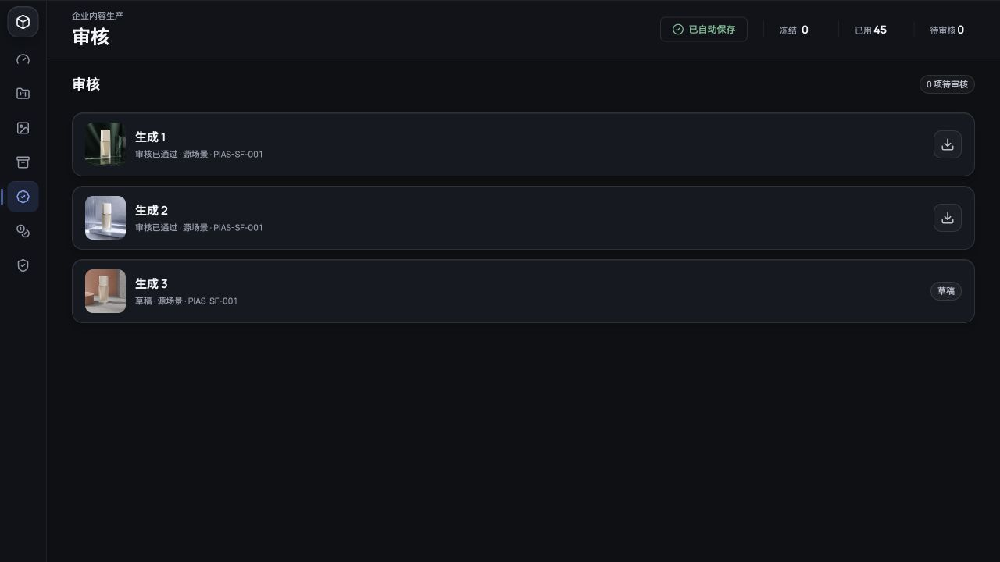

# Content Studio Workbench 验收自查报告

## 1. 结论

**正式生产验收结论：红色 / 不予验收。**

当前版本已经达到可交互 MVP 和受控演示水平：八类图片工具可提交 Fal 异步任务，具备结果血缘、审核守卫、生产导出限制、单机业务状态持久化和较完整的前端回归测试。但生产必需的真实身份权限和租户隔离仍未实现，命中 2 个 P0 否决项，因此不能进入正式业务使用。

这不是“代码跑不起来”：自动化门禁中 Git 检查、211 项测试和生产构建全部通过。红色结论来自权限、隔离和生产基础设施闭环缺失。

## 2. 需求对齐复述

Content Studio 的目标不是单次图片生成 Demo，而是企业租户内从成员与素材准备开始，经过项目/画布、AI 异步任务、结果派生、人工审核、生产导出、额度结算和不可变审计的完整业务工作台。

核心事实必须满足：

1. 用户、租户、项目和角色决定可见数据及可执行操作，权限由服务端判定。
2. AI 任务从预检、冻结额度、排队、执行、后处理到成功/部分成功/失败/取消/过期形成持久状态机。
3. 结果保留输入、模型、参数、版本、上游血缘和审核状态，可复现、可追溯。
4. 刷新、断网、页面关闭或服务重启不改变真实任务和业务数据。
5. 额度按真实供应商执行结果结算，冻结、扣减、释放和人工调整可逐笔对账。
6. 只有具备权限且审核通过的结果可以生产导出，所有关键动作进入审计记录。

## 3. 验收范围与证据

| 项目 | 内容 |
| --- | --- |
| 验收目标 | PRD Production 完成态 |
| 代码分支 | `codex/fal-all-image-nodes` |
| 需求基线 | `docs/PRD_企业级AI全链路内容生产工作台_图片MVP_V1.2.md` |
| 代码证据 | `src`、`tests`、`scripts`、`acceptance/manifest.json` |
| 运行证据 | `npm run acceptance:report`；浏览器审核状态修改、刷新与 Vite 服务重启复验 |
| 自动化结果 | 16 个测试文件、211 项测试通过；TypeScript/Vite 生产构建通过 |
| 未提供证据 | 生产数据库与备份、身份服务、跨租户测试、生产审计台账、UAT 签字、AI 质量基准 |

## 4. 覆盖统计

业务证据项共 13 项：已通过 4 项、部分实现 5 项、失败 2 项、缺失 2 项。可完全证明通过率为 `4 / 13 = 30.8%`。

加入 3 项自动化检查后共 16 项：通过 7 项、部分实现 5 项、失败 2 项、缺失 2 项。

| 自查层级 | 已检查 | 主要结论 |
| --- | --- | --- |
| 第一阶：业务完整性 | AI 主链路、逆向操作、审核、导出、成员/项目/素材入口 | 主 AI 链路可运行；企业开通和多项辅助业务入口未闭环 |
| 第二阶：代码与显性 Bug | 类型、状态守卫、接口代理、测试、生产构建 | 自动化通过；发现若干无响应按钮和硬编码操作者 |
| 第三阶：边界与异常 | 空值、额度不足、重复结算、失败、取消、重试、恢复 | 基础校验与单机恢复存在；部分成功、过期、运行中取消结算和多实例恢复不完整 |
| 第四阶：数据与状态 | 任务状态、结果血缘、审核状态、用量、审计、租户上下文 | 血缘、局部守卫和版本化快照正确；权限、隔离、数据库和不可变台账缺失 |

## 5. 问题清单

| 问题编号 | 类型 | 所在位置 | 触发条件 | 实际结果 | 期望结果 | 等级 | 修复方案 | 验证方式 | 证据状态 |
| --- | --- | --- | --- | --- | --- | --- | --- | --- | --- |
| CS-P0-001（已修复基线缺陷） | 数据 | `src/studio/studioStatePersistence.ts`; `src/studio/usePersistentStudioState.ts` | 修改审核状态后刷新页面或重启 Vite 服务 | `StudioState` 通过 revision API 原子写入本机文件，页面按确认版本恢复；不再回到固定演示状态。保存尚未确认时立即关闭页面仍可能丢失最后一次变更 | 生产数据库、备份恢复、多实例一致性和关闭前未确认写入保护均可证明 | P1 | 将版本化存储接口迁移到事务数据库，补租户作用域、备份恢复、多实例并发和关闭页面恢复测试 | revision 冲突单测；刷新、服务重启、API/文件/页面核对 | 已确认写入的自动化与浏览器复验通过 |
| CS-P0-002 | 权限 | `src/App.tsx`; `src/SecondaryViews.tsx:300-369` | 任意访问者打开审核页并点击通过、退回或导出 | 无登录会话和服务端授权，界面操作直接修改本地状态 | 仅被授权 Reviewer/Admin 可审核，导出按角色和项目策略校验 | P0 | 接入身份服务、会话和 MFA；所有命令 API 服务端执行 RBAC；前端仅展示能力 | Creator/Reviewer/Viewer 权限 E2E；旧会话失效测试；直接 API 越权测试 | 静态证据 |
| CS-P0-003 | 权限/数据 | `src/domain.ts:164-177` | 构造其他租户或项目资源 ID 请求 | 状态只有租户/项目名称，没有主体 ID、访问范围或隔离查询 | 每次请求同时校验 Tenant、Project、Role，跨租户统一拒绝且记录审计 | P0 | 所有业务表增加 `tenant_id`/`project_id`；请求注入可信租户上下文；仓储层强制作用域 | 双租户同构数据 IDOR 测试、搜索泄露测试、审计核对 | 静态证据 |
| CS-P1-001 | 状态 | `src/domain.ts:1-2,71-85` | 执行后处理、部分成功、取消请求、硬超时或重试 | 状态只含 queued/running/succeeded/failed/canceled，无法表达真实阶段 | 支持 PRD 全部任务状态、合法转换、阶段耗时、重试关联和错误归一化 | P1 | 建立服务端状态机和迁移表；新增 `retry_of_job_id`、阶段记录、超时和部分输出 | 状态转换表单测；重复回调、部分成功、过期、取消 E2E | 已复现于类型定义 |
| CS-P1-002 | 数据/结算 | `src/domain.ts:375-417` | 已分发任务失败或用户取消，供应商已产生费用 | `settleJob` 无条件将全部 `reservedCredits` 退回 | 未分发全额释放；已分发按实际供应商成本和合同规则结算 | P1 | 以不可变台账记录 reserve/charge/release；结算输入包含可计费输出和供应商成本；事务内幂等入账 | 失败、部分成功、运行中取消、重试并发对账测试 | 已复现于代码分支 |
| CS-P1-003 | 健壮性 | `src/studio/studioStatePersistence.ts`; `src/fal/falJobPersistence.ts` | 页面刷新、Vite 服务重启、进程崩溃或多实例切换 | 完整业务快照与 Fal 请求映射可在单机重启后恢复，但运行中任务仍缺少持久 Worker 接管 | 任务真实状态独立于页面和单进程，可由持久 Worker 安全接管 | P1 | 使用数据库任务表和持久队列；租约、心跳、幂等回调；恢复时按 request ID 对账 | 页面关闭、进程崩溃、重复回调、Worker 接管测试 | 单机恢复已通过，多实例未验证 |
| CS-P1-004 | 业务 | `src/domain.ts`; `src/workbench/Workbench.tsx` | 提交后撤回、审核拒绝、修改参数重试、依赖部分失败 | 已有取消、退回和重试片段，但逆向链路与新旧 Job 关系不完整 | 每种逆向动作均有角色、状态、原因、通知、账务和审计闭环 | P1 | 明确命令和状态图；重试创建新 Job 并关联原任务；退回/拒绝强制原因 | 全状态迁移表和角色场景矩阵 E2E | 静态证据 |
| CS-P1-005 | 权限/审核 | `src/domain.ts:356-359,404-407`; `src/SecondaryViews.tsx` | 创建任务、结算或审批 | 操作者为 `Mika Tanaka`、`青井审核员`、`图像处理服务` 等固定字符串 | 从可信会话/服务身份取得 actor ID，并保存角色和租户上下文 | P1 | API 命令从鉴权上下文生成审计主体，禁止客户端提交最终 actor | 伪造 actor 请求、跨角色审批、审计完整性测试 | 静态证据 |
| CS-P2-001 | 业务/UI | `src/SecondaryViews.tsx:252-282,398-455` | 点击新建项目、上传、邀请成员、导出清单或审计日志 | 按钮无事件处理，用户无反馈 | 完成流程或明确禁用并从当前范围移除入口 | P2 | 接入真实表单与 API；未实现能力使用 disabled 和可解释状态，不展示假命令 | 浏览器逐按钮测试和可访问性断言 | 已复现于组件代码 |

## 6. 无问题维度声明

在本次提供的代码和自动化证据范围内，以下维度无问题：

- **自动化与构建无问题**：16 个测试文件、211 项测试通过；生产构建通过。
- **单机刷新与重启恢复无问题**：项目、画布、任务、结果、审核、用量和审计状态通过版本化 API 原子写入，浏览器刷新和 Vite 服务重启后均能恢复。
- **Fal 密钥暴露维度无问题**：密钥由 Vite 服务端代理读取，未进入浏览器请求参数或构建产物的既有实现路径。
- **结果可追溯核心字段无问题**：结果记录模型 ID、供应商 request ID、参数、种子、生成时间和上游结果。
- **结果血缘维度无问题**：派生 Scene 保留父 Scene、源 Result、素材版本和操作类型。
- **重复任务结算守卫无问题**：终态 Job 再次结算会被领域函数拒绝。
- **生产导出状态守卫无问题**：未批准结果不能进入现有生产导出函数。

这些结论只覆盖当前代码路径，不代表跨租户安全、真实对象存储、签名链接、供应商数据政策或生产运维已通过；后者目前证据不足。

## 7. 浏览器复验证据

在隔离状态文件下启动 `http://127.0.0.1:5174/`，执行以下步骤：

1. 打开“审核”，初始显示 `1 项待审核`。
2. 对“生成 1”点击“通过审核”，等待顶部变为“已自动保存”，页面显示 `0 项待审核`。
3. 刷新页面，画布恢复为 `2 已通过 / 0 待审核`，审核页仍为 `0 项待审核`。
4. 停止并重新启动 Vite 服务，再次刷新；页面、API 和本机状态文件仍一致显示两项 `approved`，快照 revision 为 `2`。
5. 浏览器控制台无 error 或 warning。

该复验确认 `CS-P0-001` 的刷新与单机服务重启丢失缺陷已修复。由于当前存储仍是单机文件，生产数据库、备份和多实例一致性尚未达标，因此剩余风险降级为 P1，而不是标记为完全通过。

## 8. 整改顺序

### 第一批：清除 P0

1. 建立用户、租户、项目、角色和访问范围的服务端数据模型。
2. 接入登录、会话、MFA、RBAC 和租户/项目隔离中间件。
3. 将所有命令 API 纳入可信身份与租户上下文，补直接 API 越权和跨租户 IDOR 测试。

### 第二批：清除 P1

1. 落地完整 Job 状态机、持久队列、Worker 租约、心跳、幂等回调和重试关联。
2. 建立不可变额度台账和供应商成本结算，覆盖部分成功、取消、失败、超时和重试。
3. 补齐审核拒绝/撤回、修改后重试、错误归一化、追踪 ID 和通知闭环。
4. 用可信身份替换所有硬编码 actor，并补权限集成测试。
5. 将单机版本化快照迁移到事务数据库，完成备份恢复和多实例并发验证。

### 第三批：完成业务入口与生产证据

1. 实现或移除无响应入口。
2. 补跨租户、权限、恢复、并发、迁移和完整 E2E。
3. 执行 Content Studio 固定基准集和 UAT，归档人工签字与结果证据。

## 9. 复验条件

只有以下条件同时满足，才可重新申请绿色验收：

- `acceptance/manifest.json` 所有必选项均有真实证据并标记为 `pass`。
- `npm run acceptance` 返回退出码 0。
- 2 个 P0 和 6 个 P1 均附修复提交、自动化回归和人工复现记录。
- 双租户权限 E2E、刷新/进程重启恢复、任务重复回调和额度逐笔对账全部通过。
- 固定 AI 基准集、UAT、备份恢复和生产运维证据完成归档。

在上述条件达成前，推荐环境标识为“演示 / 内部试用”，不得对外宣称 Production Ready。
